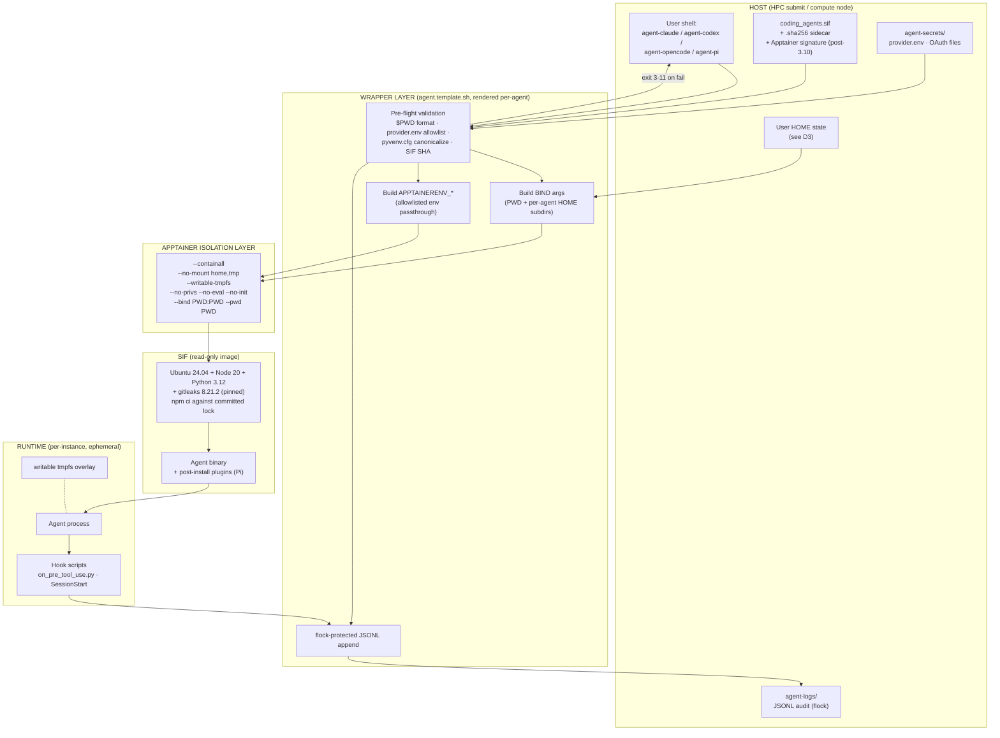
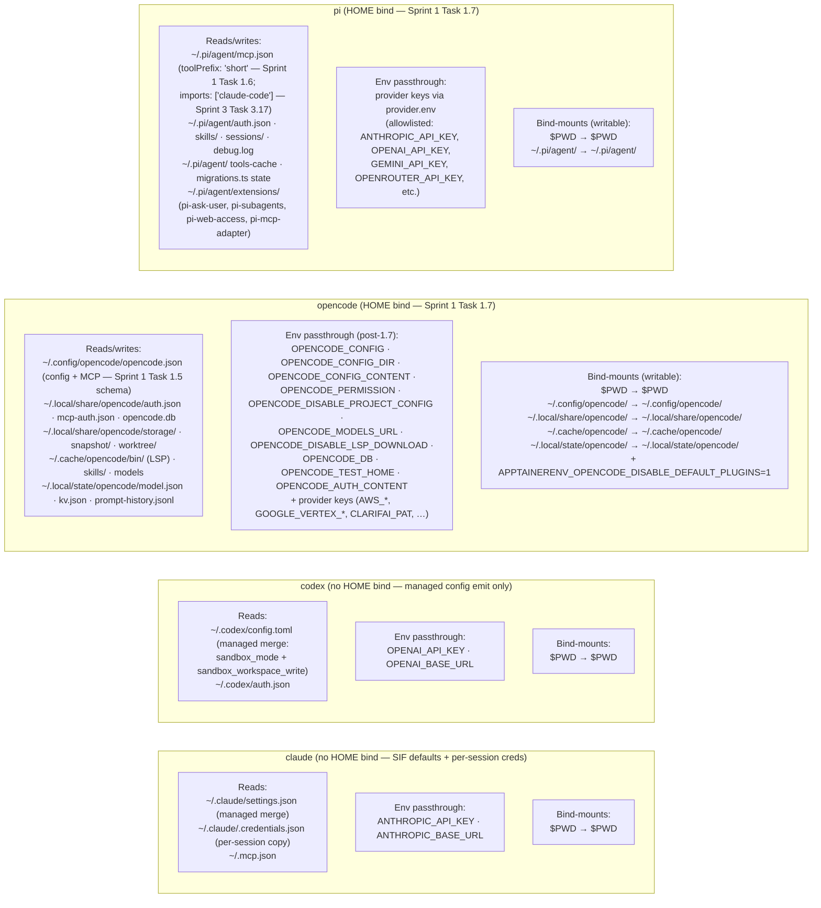
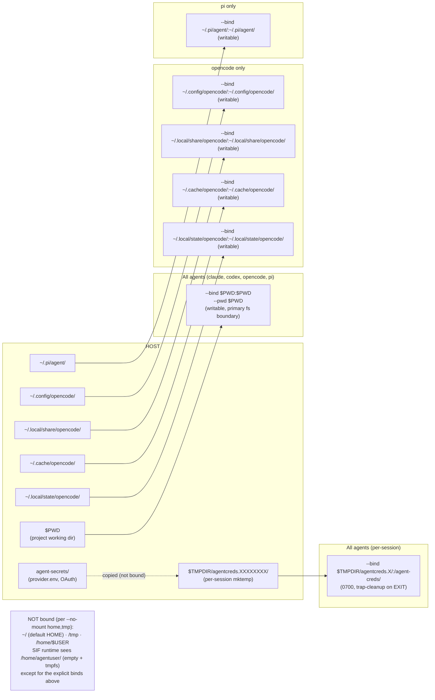
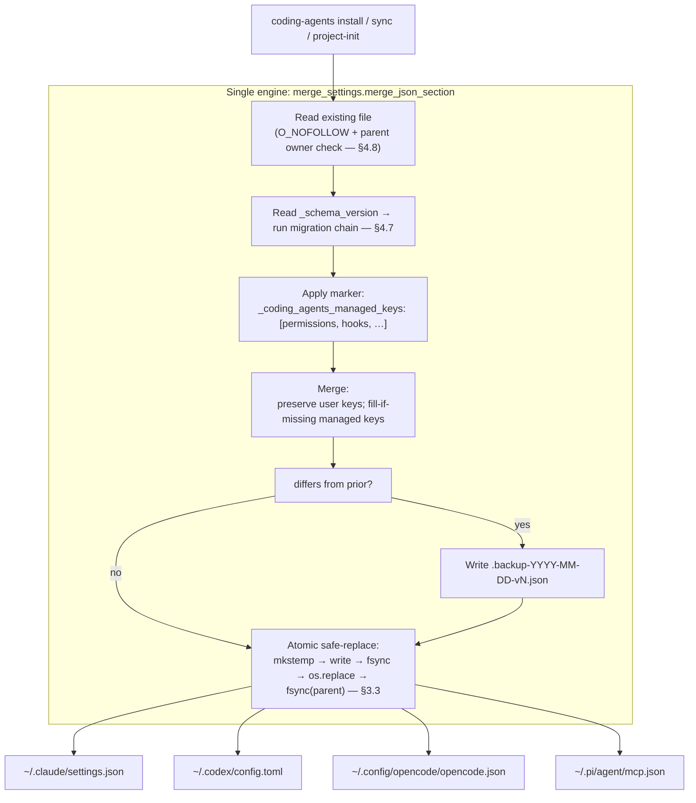
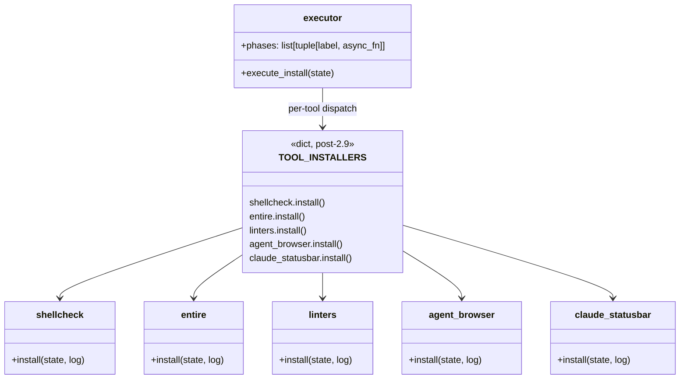

# MVP Review Remediation & v1 Finalization

## Overview

This plan executes every remediation item identified by the eleven-agent code review captured in `docs/full_review_26_04_2026_synthesis.md` (the "synthesis"). It is structured as four sequenced sprints that map 1:1 onto the synthesis bins — MUST-FIX (§3), URGENT (§4), NICE-TO-HAVE (§5, which also closes the v1 plan's Phase 3 and Phase 4 gaps), and NON-ESSENTIAL cleanup (§6). The endpoint is "v1 final" — the MVP rolled out lab-wide with the first patch release applied, all v1 plan phases completed, and the codebase ready to evolve into v2 without entangled rewrites.

The synthesis is the binding source of truth for line-level evidence. Every task below cross-references the synthesis section that motivates it (e.g. `[§3.1]`) so a reader can navigate from this plan back to the eleven sub-reports.

The user's authoritative decision on the §3.10 / §3.12 sandbox-compat strategy: **for both Pi and OpenCode, bind-mount the needed HOME subdirectories into the container** (writable, host_path → container_path). This overrides the synthesis's per-project `APPTAINERENV_PI_CODING_AGENT_DIR` recommendation (option (a) for Pi) in favour of a uniform bind-mount strategy across both agents (option (b) variant).

## Problem Statement

The MVP that shipped on `main` @ `860aa38` is a competent first cut (B+ per synthesis §14): registry-driven design, pure-function cores, NFS-aware primitives, dry-run as a recorder, and a wrapper-template drift contract. 124 tests pass.

But the eleven specialist reviewers converged on **12 MUST-FIX issues** that block first lab-wide rollout, **17 URGENT issues** that should land in the first patch release, **22 NICE-TO-HAVE items** (most of which complete the v1 plan's Phase 3/4), and **9 NON-ESSENTIAL cleanup items**. The findings concentrate in three domains:

1. **Wrapper-template security & data integrity** — audit-log JSONL injection through `$PWD`/`jq`, env-poisoning via unvalidated `provider.env` keys (`PYTHONSTARTUP`/`NODE_OPTIONS`/`BASH_ENV`), non-atomic `secure_write_text` (Ctrl-C zeros settings), and non-line-atomic JSONL appends for argv > 4 KB.
2. **Integration correctness with upstream agents** — Codex `[sandbox] deny_paths` is a fictional key; OpenCode's MCP emitter writes the wrong field shape (silently rejected by Effect Schema); Pi's `~/.pi/agent` is invisible inside the SIF (Pi runs in "minimal" mode with no MCP, no plugins, no auth); OpenCode's `--no-mount home` discards `~/.config/opencode/`, `~/.local/share/opencode/`, `~/.cache/opencode/`, `~/.local/state/opencode/`; `convert_mcp.py:161` writes a `toolPrefix` value not in the enum.
3. **Operational hygiene** — duplicate `bundled/` trees on disk that have already drifted; Codex deny-rules dispatch dead-codes after `agents.py:34` declares `"codex_toml"` while `commands/sync.py:155` switches on `"starlark"`; user-overridable `~/.claude/settings.json` silently ignores managed-only keys; README still documents `npm i -g opencode` (404 — package is `opencode-ai`).

**v1 plan adherence is ~85 %.** Phase 1 (foundation) and Phase 2 (SIF + secrets bootstrap) are fully met. Phase 3 (managed settings + deny rules + helpers + TUI screen) is partial: emit work landed but the replacement `SandboxConfigScreen`, `commands/project_init.py` git-ignore + gitleaks helpers are open. Phase 4 (sync, uninstall, doctor refactor, README, sandbox-check) is mostly missing. No v2-deferred item leaked into MVP.

This plan closes all four bins and the two open v1 plan phases in one coordinated, sequenced effort.

## Proposed Solution

Four sequenced sprints, each a self-contained release milestone:

- **Sprint 1 (Phase 1 of this plan): MUST-FIX (~13 h).** Unblocks first lab-wide rollout. Tightly-scoped patches to `bundled/templates/wrapper/agent.template.sh`, `src/coding_agents/utils.py`, `src/coding_agents/installer/policy_emit.py`, `src/coding_agents/convert_mcp.py`, `src/coding_agents/commands/sync.py`, the `bundled/` tree dedup, and one README line. Single PR per fix family (security trio, atomicity, integration, dedup, README).
- **Sprint 2 (Phase 2 of this plan): URGENT (~35 h).** First patch release. Includes the largest refactor in the codebase (`executor.py` 917-line per-tool extraction — `SandboxBackend` protocol dropped per user decision since v2/bubblewrap is off the roadmap) and the systematic schema-versioning + atomic-write hardening that prevents future silent-corruption. Parallelisable across two engineers into ~3 calendar weeks.
- **Sprint 3 (Phase 3 of this plan): NICE-TO-HAVE + v1 plan completion (~20 h).** Closes the v1 plan's Phase 3/4 gaps (`SandboxConfigScreen`, `project_init` git-ignore + gitleaks pre-commit, `sync.py` three helpers, `scripts/hpc_sandbox_check.sh`, doctor `IntEnum + CheckResult` refactor + exit-code 2 + `tests/test_doctor.py`, README full rewrite, OpenCode deny-rule emit, SIF signing) and lifts test/code quality (`@dataclass` conversions, PEP-8 import ordering, test-idiom migration).
- **Sprint 4 (Phase 4 of this plan, parallel): NON-ESSENTIAL cleanup (~3 h).** `.backup`/`.DS_Store` purge + gitignore, npm pin tightening, magic-number hoisting, observer cleanup. Can be done in parallel with any sprint by anyone with a free hour.

Total effort: **~71 hours** (~13 h Sprint 1 + ~35 h Sprint 2 + ~20 h Sprint 3 + ~3 h Sprint 4). Folded into Sprint 1: Pi MCP `imports` migration (was Sprint 2 §4.16 + Sprint 3 §5.21). Dropped: `SandboxBackend` protocol (was ~3 h in Sprint 2 §4.9 part 2). For a 2-engineer team, ~5 calendar weeks if Sprint 2 is parallelised. Sprints 3–4 can interleave with Sprint 2 once the executor split lands.

## Technical Approach

### Architecture

#### Cross-cutting design decisions

These decisions affect work in multiple sprints and are made up-front to avoid mid-sprint refactor churn.

1. **Sandbox-compat strategy is uniform bind-mount for Pi + OpenCode.** Per the user's decision: bind-mount the host HOME subdirs that each agent needs into the container at the same path. Writable bind-mounts (so auth, sessions, snapshots persist across invocations). The wrapper template gets a per-agent `BIND_HOME_DIRS` array. This is incompatible with synthesis §7's recommended Pi option (a) `APPTAINERENV_PI_CODING_AGENT_DIR=$PWD/.pi/agent` — that path is dropped. (See "Alternatives Considered" §A1 below.)

2. **One settings-merge engine: marker-based, preserves user keys.** `policy_emit.merge_claude_settings` (template-clobber) is folded into `merge_settings.merge_json_section` (marker-based). All call sites — `executor._emit_managed_policy`, `executor._merge_existing_settings`, `commands/sync.py`, `commands/project_init.py` — route through one engine. The marker is `_coding_agents_managed: true` per Sprint 2 item 2.6. Drift backups (`.backup-YYYY-MM-DD`) continue to fire only on differing content.

3. **All persisted JSON/TOML carry `_schema_version`.** Sprint 2 item 2.7 establishes a minimal migration framework. Sprint 1 introduces the field with version `1` everywhere; Sprint 2 wires the migration dispatch. This decouples the MUST-FIX atomicity work (which must ship now) from the longer-tail schema-evolution machinery.

4. **`SandboxBackend` protocol — DROPPED (user decision 2026-04-27).** Synthesis §4.9 originally proposed introducing a `SandboxBackend` protocol so v2's bubblewrap backend could slot in without touching `execute_install`. The user has confirmed v2/bubblewrap is not on the roadmap, so the protocol is YAGNI. The remaining piece of synthesis §4.9 — extracting per-tool installers from the 917-line `executor.py` god-module — is independently valuable for code clarity and stays in Sprint 2 (Task 2.9a). If v2 is ever revisited, the `SandboxBackend` protocol remains the natural extension point and can be added then; the per-tool extraction does not block it.

5. **Single canonical `bundled/` tree.** Sprint 1 item 1.3 picks `src/coding_agents/bundled/` as the single source of truth (so the data ships with the wheel via hatch's `packages = ["src/coding_agents"]`) and replaces the outer `<repo>/bundled/` with a stub README that points at it, plus a CI check that fails on divergent content. The stale root-level `hooks/` directory is deleted.

6. **CI guardrails added in Sprint 1 item 1.0.** Three new CI checks: (a) bundled-tree no-divergence, (b) registry-vs-handler symmetry (`agents.py::deny_rules_format` strings match `policy_emit.py` + `commands/sync.py` dispatch tables), (c) wrapper-template `{{VAR}}` placeholders match `WRAPPER_VARS` (the existing drift-detect test, run as a CI gate). These prevent the §3.5 / §3.6 bug classes from regressing.

#### Module-level changes overview

| Module | Sprint(s) | Net change |
|---|---|---|
| `bundled/templates/wrapper/agent.template.sh` | 1, 2 | Security trio (§3.1/§3.2/§3.4), bind-mount logic for Pi+OpenCode (§3.10/§3.12), pyvenv.cfg hardening (§4.2), SIF integrity verify (§4.1), additional `OPENCODE_*` env-var passthrough (§3.12 bonus). |
| `src/coding_agents/utils.py` | 1, 2 | Atomic safe-replace `secure_write_text` (§3.3); split into `io_safe.py`/`proc.py`/`pkgmgr.py`/`shell_rc.py`/`platform_info.py` (§4.10); O_NOFOLLOW + parent-validation (§4.8); `_strip_marked_block` factor-out (§5.9). |
| `src/coding_agents/agents.py` | 2 | `AgentDef` `TypedDict` with `Literal[...]` for format strings (§4.11); per-agent function-pointer hooks (§4.13). |
| `src/coding_agents/installer/executor.py` | 2 | Extract per-tool installers into `installer/tools/{shellcheck,entire,linters,agent_browser,claude_statusbar}.py` (§4.9 part 1). Net 917 → ~500 lines. (`SandboxBackend` protocol from §4.9 part 2 is dropped — v2 not on roadmap.) |
| `src/coding_agents/installer/policy_emit.py` | 1, 2 | Codex `[sandbox]` schema rewrite (§3.7); `copy.deepcopy` instead of JSON round-trip (§4.5); engine unification with `merge_settings` (§4.6); schema-version stamp (§4.7). |
| `src/coding_agents/convert_mcp.py` | 1, 2 | New `_write_opencode` writer per OpenCode Effect Schema (§3.9); `toolPrefix: "short"` for Pi (§3.10); Pi MCP backup-before-overwrite or migrate to `imports: ["claude-code"]` (§4.16/§5.21); dispatch table updated. |
| `src/coding_agents/commands/sync.py` | 1, 3 | Dispatch fix `"starlark"` → `"codex_toml"` (§3.6); add `_sync_managed_settings`, `_sync_codex_config`, `_sync_sif_sha_sidecar` (§5.6); narrow exception handling (§4.4); CLI error pattern (§4.12). |
| `src/coding_agents/commands/uninstall.py` | 2, 3 | Transactional ordering + `coding-agents repair` (§4.15); opt-in prompts for secrets/logs (§5.8). |
| `src/coding_agents/commands/doctor.py` | 2, 3 | `IntEnum + CheckResult` refactor (§5.1); exit-code `0/1/2` contract (§5.2); concurrent version checks + `which` memoize (§5.15); narrow exception handling (§4.4). |
| `src/coding_agents/commands/project_init.py` | 3 | Git-ignore + gitleaks pre-commit helpers (§5.5); registry-driven dispatch (§4.13). |
| `bundled/coding_agent_hpc.def` | 2, 3 | `apt-get clean` (§4.17 S1), multi-stage build (§4.17 S2), `npm cache clean --force` (§4.17 S4), digest-pinned base image (§5.13). |
| `bundled/templates/managed-claude-settings.json` | 1 | Verify `disableBypassPermissionsMode` value type against `https://json.schemastore.org/claude-code-settings.json`; add `$schema` ref (§3.8). |
| `bundled/hooks/deny_rules.json` | 1 | Drop `codex_config_toml_deny_paths` key (§3.7); add `_schema_version: 1` (§4.7). |
| `bundled/hooks/_hook_runner.py` | 2 | New shared boilerplate runner; per-hook scripts shrink to 3 lines each (§4.14). |
| `installer/screens/sandbox_config.py` | 3 | New TUI screen for SIF path / secrets / logs / SLURM defaults (§5.4 / v1 plan M24). |
| `scripts/hpc_sandbox_check.sh` | 3 | New companion to `hpc_prereq_check.sh` (§5.7 / v1 plan Phase 4 task 3). |
| `tests/test_doctor.py` | 3 | New file; covers Apptainer absent → FAIL, SIF unreadable → WARN, exit-code contract (§5.3). |
| `tests/test_migrations.py` | 2 | New; one fixture per historical schema version; asserts each migrates to current (§4.7). |
| `tests/test_bundled_tree_dedup.py` | 1 | New; CI guard for `bundled/` divergence (§3.5). |
| `tests/test_registry_symmetry.py` | 1 | New; asserts every `deny_rules_format` has handlers in policy_emit + sync (§3.6). |
| `tests/test_schema_validation.py` | 3 | New; round-trips emitted Codex/OpenCode JSON-TOML through their fresh schemas (§5.16). |
| `README.md` | 1, 3 | Sprint 1: one-line `opencode` → `opencode-ai` (§3.11). Sprint 3: full rewrite — quick-start, conda/venv idiom, DPO callout, troubleshooting table for wrapper exit codes 3/4/5/7/8 (§5.17). |

### Architecture Diagrams

These diagrams describe the **target state** after Phase 1 + Phase 2 land (i.e. after Sprint 1 fixes the §3.10 / §3.12 bind-mount gap and Sprint 2 introduces the `SandboxBackend` protocol). Anywhere a node says "post-Sprint X" it is not present today.

#### D1. Layered architecture: host → wrapper → Apptainer → SIF → agent



#### D2. Wrapper invocation sequence (post-Sprint 1 + Sprint 2 Task 2.1)

```mermaid
sequenceDiagram
    autonumber
    participant U as User shell
    participant W as agent.template.sh
    participant FS as Host filesystem
    participant J as jq
    participant L as audit JSONL (flock fd 9)
    participant A as apptainer exec
    participant G as Agent process (in SIF)
    participant H as Hook (on_pre_tool_use)

    U->>W: agent-<name> <args>
    W->>W: validate $PWD (regex: no `"` / ctrl / \n) — exit 6 on fail
    W->>FS: read agent-secrets/provider.env
    W->>W: parse with KEY allowlist + poisonous-name blocklist
    W->>FS: realpath -e $SIF; read $SIF.sha256 sidecar
    W->>FS: sha256sum $SIF
    W->>W: compare → exit 7 on mismatch
    W->>FS: read pyvenv.cfg; canonicalize realpath; check against allowlist
    W->>W: build APPTAINER_BIND[] (PWD + per-agent HOME)
    W->>W: build APPTAINERENV_*[] (allowlisted)
    W->>J: jq -n --arg ts ... --argjson argv ...
    J-->>W: validated JSON line
    W->>L: ( flock 9; printf '%s\n' >&9 ) — line-atomic
    W->>A: apptainer exec --containall --bind ... --pwd $PWD ...
    A->>G: enter SIF; drop privs; tmpfs overlay
    G->>G: read settings (host-bound or in-SIF defaults)
    G->>H: tool call (e.g. Bash($cmd))
    H->>FS: read deny_rules.json
    H-->>G: permit / block
    G-->>U: tool result
```

#### D3. Per-agent file & environment topology



#### D4. Bind-mount matrix (host path ↔ container path, by agent)



#### D5. Defense-in-depth (security layers)

```mermaid
flowchart TB
    subgraph L1["Layer 1 — Wrapper input validation (host-side, pre-Apptainer)"]
        L1a["$PWD format allowlist<br/>(no `\"` / ctrl / newline) — Sprint 1 §3.1"]
        L1b["provider.env KEY regex<br/>+ poisonous-name blocklist (PATH, LD_*, BASH_ENV, …) — Sprint 1 §3.2"]
        L1c["pyvenv.cfg path canonicalize<br/>+ allowlist — Sprint 2 §4.2"]
        L1d["AGENT_SIF override restricted to<br/>shared-agent dir — Sprint 2 §4.1"]
        L1e["Parent dir owner / O_NOFOLLOW<br/>on settings writes — Sprint 2 §4.8"]
    end

    subgraph L2["Layer 2 — SIF integrity"]
        L2a["SHA-256 sidecar verify<br/>(Sprint 2 §4.1)"]
        L2b["Apptainer signature verify<br/>(Sprint 3 §5.14)"]
        L2c["Digest-pinned base image<br/>(Sprint 3 §5.13)"]
        L2d["npm ci against committed lockfile<br/>(integrity hashes)"]
    end

    subgraph L3["Layer 3 — Apptainer isolation"]
        L3a["--containall (cleanenv + IPC + PID + …)"]
        L3b["--no-mount home,tmp"]
        L3c["--writable-tmpfs (ephemeral overlay)"]
        L3d["--no-privs (strip file capabilities)"]
        L3e["--no-eval --no-init (belt-and-braces)"]
        L3f["--bind PWD:PWD --pwd PWD (fs boundary)"]
    end

    subgraph L4["Layer 4 — Inside-SIF policy"]
        L4a["deny_rules.json hooks<br/>(SessionStart + on_pre_tool_use)"]
        L4b["managed-claude-settings.json<br/>(deny ~/.ssh, ~/.aws, ~/.codex/auth.json, ./.env, ./secrets/**)"]
        L4c["Codex sandbox_workspace_write<br/>(network_access=false) — Sprint 1 §3.7"]
        L4d["OpenCode permission schema<br/>— Sprint 3 §5.11"]
        L4e["Pi extension hooks<br/>(post-v2 permission-gate)"]
    end

    subgraph L5["Layer 5 — Audit & forensics"]
        L5a["JSONL audit log<br/>(flock-protected, line-atomic) — Sprint 1 §3.4"]
        L5b["Drift backup<br/>.backup-YYYY-MM-DD-vN.json"]
        L5c["Schema-versioned files<br/>+ migration journal — Sprint 2 §4.7"]
        L5d["Atomic safe-replace writes<br/>(no zero-byte settings) — Sprint 1 §3.3"]
    end

    L1 --> L2
    L2 --> L3
    L3 --> L4
    L4 --> L5
```

#### D6. Settings merge flow (post-Sprint 2 Task 2.6 — single engine)



#### D7. Executor decomposition (post-Sprint 2 Task 2.9)



(The `SandboxBackend` protocol from synthesis §4.9 part 2 is intentionally not introduced — v2/bubblewrap is off the roadmap. If revisited, the protocol slots in here as a peer to `TOOL_INSTALLERS` without further executor changes.)

### Implementation Phases

---

#### Phase 1 (Sprint 1) — MUST-FIX: unblock first lab-wide rollout

**Effort: ~13 hours.** Single coordinated PR per fix family (security trio, atomicity, dedup/dispatch, integration, README). Five PRs total.

##### Task 1.0 — Pre-flight CI guardrails (~30 min) [§3.5, §3.6]

Set up the three CI guards before any other Sprint 1 work, so subsequent fixes ship with regression gates already in place.

- [x] Add `tests/test_bundled_tree_dedup.py` that runs in CI and fails if both `<repo>/bundled/` and `<repo>/src/coding_agents/bundled/` exist with diverging content (path-by-path `sha256` compare). For Sprint 1, the test asserts the outer tree is a single-file stub. [§3.5]
- [x] Add `tests/test_registry_symmetry.py` asserting every `deny_rules_format` declared in `agents.py::AGENTS` has a corresponding handler in `policy_emit.py` (install path) and `commands/sync.py::_apply_*` (sync path). [§3.6]
- [x] Promote `tests/test_wrappers.py::test_template_placeholders_match_wrapper_vars` to a required CI gate (it's already a test; add an explicit CI step). [§2.3]

##### Task 1.1 — Wrapper security trio (`bundled/templates/wrapper/agent.template.sh`) (~2.5 h) [§3.1, §3.2, §3.4]

All three patches touch the same file; ship as one PR.

- [x] **§3.1 audit-log JSONL injection.** Pre-validate `$PWD` at wrapper entry: refuse the invocation (exit 6) if `$PWD` contains `"`, control characters (0x00-0x1F), or newlines. Build the JSONL line entirely through `jq -n --arg ts "$TS" --arg agent "$AGENT_NAME" --arg pwd "$PWD" --arg slurm "$SLURM_JOB_ID" --arg sha "$SIF_SHA" --argjson argv "$ARGV_JSON" '{...}'` so escaping is uniform. Make `jq` a host-side hard requirement (already a SIF-side requirement). Drop the fallback path that interpolated `$PWD` unsafely.
  - Future-direction note: synthesis [performance F1] suggests dropping `jq` for ~30 ms savings via pure-bash JSON encoding; tracked as Sprint 2 follow-up.
- [x] **§3.2 `provider.env` parser env-poisoning.** Reject any `KEY` not matching `^[A-Z][A-Z0-9_]{0,63}$`. Maintain an explicit allowlist matching the inline comment block at lines 122-151 (provider API keys + endpoints — `*_API_KEY`, `*_TOKEN`, `*_ENDPOINT`, `*_BASE_URL`, plus the explicit `OPENAI_*`/`ANTHROPIC_*`/`AZURE_*`/etc. names already enumerated). Refuse known-poisonous names: `PATH`, `LD_*`, `LIBPATH`, `PYTHON*`, `NODE_*`, `BASH_ENV`, `ENV`, `PROMPT_COMMAND`, `PS1`, `IFS`, `HOME`, `USER`. Apply the **same** allowlist to the `*_api_key`/`*_token`/`*_endpoint` glob loop at lines 152-169 ([security M1] cross-ref).
- [x] **§3.4 audit-log JSONL `flock`.** Wrap the append with `flock 9` (`( flock 9; printf '...' >&9 ) 9>>"$AGENT_LOGS_DIR/${AGENT_NAME}-${TODAY}.jsonl"`) so concurrent writers in the same allocation cannot interleave bytes mid-line.
- [x] Add tests in `tests/test_wrappers.py`:
  - [ ] `test_pwd_with_quote_rejected` — wrapper exits non-zero when `cd '/tmp/foo"bar'`.
  - [ ] `test_provider_env_rejects_bash_env` — `provider.env` containing `BASH_ENV=...` does not appear in `env` inside the rendered Apptainer command.
  - [ ] `test_provider_env_rejects_lowercase_key` — `provider.env` containing `path=/tmp` rejected.
  - [ ] Mock `flock` and assert it's called with the audit-log fd (visual inspection test; full concurrency test is integration-level).

##### Task 1.2 — Atomic settings writer (~1 h) [§3.3]

- [x] Replace `utils.secure_write_text` body with POSIX safe-replace: `mkstemp` in same dir → `os.write(fd, data)` → `os.fsync(fd)` → `os.close(fd)` → `os.replace(tmp_path, path)` → open parent dir → `os.fsync(parent_fd)` → close parent. Permissions stay 0o600 (set on `mkstemp` via `os.chmod` since `mkstemp` uses 0o600 by default).
- [x] Update `safe_symlink` doc comment to note it already uses the same pattern (`mkstemp + unlink + symlink + rename`) so the codebase has one canonical pattern doc.
- [x] Add fork-based unit test in `tests/test_utils.py::test_secure_write_text_atomic_under_kill`: fork; child opens `secure_write_text` and is `SIGKILL`'d mid-write (use `os.write` patched to block on a semaphore); parent verifies file is either non-existent or fully-written original — never zero-byte.
- [x] Add `_schema_version: 1` to `DEFAULT_CONFIG` in `config.py` and to the templates that get persisted (`managed-claude-settings.json`). Migration dispatch comes in Sprint 2 item 2.7; Sprint 1 only stamps the field.

##### Task 1.3 — Bundled tree dedup + stale root cleanup (~1 h) [§3.5]

- [x] Pick `src/coding_agents/bundled/` as canonical (ships with wheel via hatch).
- [x] Replace `<repo>/bundled/` with a single `README.md` stub: "This tree is now sourced from `src/coding_agents/bundled/`. Edit there." Move any content unique to the outer tree (the `coding_agent_hpc.def`, `bundled/sif/README.md`, build instructions) to `<repo>/build/` if they are build-time files not shipped with the wheel — verify each path's runtime consumer before moving.
- [x] Delete the stale root-level `<repo>/hooks/` directory entirely (its content is leftover from before the move into `bundled/` and is missing 8 home-dir denies + the `Read(./build) → Read(./build/**)` fix).
- [x] `git rm` the committed `.DS_Store` files inside `src/coding_agents/bundled/` and `src/coding_agents/bundled/skills/`.
- [x] Update any references in `coding_agent_hpc.def`, `bundled/sif/README.md`, and the build instructions to point at the canonical path.
- [x] Verify `tests/test_bundled_tree_dedup.py` (from Task 1.0) passes.

##### Task 1.4 — Codex integration trio (~2 h) [§3.6, §3.7]

- [x] **§3.6 dispatch fix.** In `commands/sync.py:155`, replace `elif fmt == "starlark":` with `elif fmt == "codex_toml":` and have it call `policy_emit.install_codex_deny_paths()` (the install path) directly. Delete `_apply_codex_deny()` if it's the only Starlark consumer; otherwise narrow it. Verify `tests/test_registry_symmetry.py` (from Task 1.0) passes.
- [x] **§3.7 Codex `[sandbox]` schema rewrite.** In `policy_emit.merge_codex_deny_paths()` (and the consumed `bundled/hooks/deny_rules.json::codex_config_toml_deny_paths` key), replace the fictional `[sandbox] deny_paths` with the real schema:
  ```toml
  sandbox_mode = "workspace-write"

  [sandbox_workspace_write]
  network_access = true        # user decision 2026-04-27: agent needs npm/pip/API egress
  exclude_tmpdir_env_var = false
  exclude_slash_tmp = false
  ```
  Rationale for `network_access = true`: agents routinely need outbound HTTP for `npm install`, `pip install`, model API calls. Apptainer's `--containall` doesn't block egress at the kernel level either, so a `false` here would be inconsistent with the surrounding sandbox. Document the trade-off in the README rewrite (Task 3.13): users wanting full network lockdown should set `sandbox_mode = "read-only"` (which also stops file writes; an `audit-only` mode).
- [x] Drop `codex_config_toml_deny_paths` from `deny_rules.json`. Document in `README.md` (Sprint 3 rewrite) that local-mode Codex requires `sandbox_mode = "read-only"` for full lockdown.
- [x] Add `tests/test_policy_emit.py::test_codex_writes_workspace_write_schema` asserting the emitted TOML has `sandbox_mode` and the `[sandbox_workspace_write]` table.
- [x] Cross-reference: verify the `tests/test_sync.py` Codex sync test now passes (it should have been silently no-op'ing before).

##### Task 1.5 — OpenCode MCP shape fix (~1.5 h) [§3.9]

- [x] In `src/coding_agents/convert_mcp.py`, add a dedicated `_write_opencode(servers, home)` writer per the OpenCode Effect Schema:
  ```python
  def _write_opencode(servers: dict, home: Path) -> list[str]:
      mcp = {}
      for name, srv in servers.items():
          if srv.get("url"):
              entry = {"type": "remote", "url": srv["url"]}
              if srv.get("headers"):
                  entry["headers"] = srv["headers"]
          else:
              entry = {"type": "local",
                       "command": [srv["command"], *srv.get("args", [])]}
              if srv.get("env"):
                  entry["environment"] = srv["env"]
          entry["enabled"] = True
          mcp[name] = entry
      _merge_json(home / ".config/opencode/opencode.json", {"mcp": mcp})
      return [str(home / ".config/opencode/opencode.json")]
  ```
- [x] Update the `MCP_FORMAT` dispatch table (`convert_mcp.py:64-71`) to call `_write_opencode` for `"opencode"`. Remove the generic `_write_json_mcp` fallback for OpenCode. **Reality-check note:** the same dispatch table currently routes `gemini` and `amp` (two additional agents in `agents.py` beyond the synthesis's four) through `_write_json_mcp` lambdas. Leave those lambdas untouched in Task 1.5 — they continue to use the generic writer. Verify both still produce schema-valid output via existing tests; flag for follow-up only if `gemini`/`amp` upstream schemas are also strict (out of scope for Sprint 1).
- [x] Add `tests/test_convert_mcp.py::test_opencode_emits_local_command_array` asserting the emitted JSON has `type: "local"`, `command` is `[cmd, *args]`, and the env is keyed `environment`.
- [x] Add `tests/test_convert_mcp.py::test_opencode_emits_remote_url` for the URL branch.

##### Task 1.6 — Pi MCP: `imports` directive + `toolPrefix` fix (~45 min) [§3.10 part 1, §4.16, §5.21]

User decision 2026-04-27: jump straight to single-source-of-truth via `imports: ["claude-code"]` in Sprint 1, rather than the staged Sprint 2 backup-before-overwrite + Sprint 3 imports-migration. This eliminates the dual-write of MCP server entries (Pi's `~/.pi/agent/mcp.json` no longer duplicates Claude's `~/.mcp.json` — Pi inherits via the pi-mcp-adapter `imports` directive). Folds in former Tasks 2.16 and 3.17.

- [x] In `src/coding_agents/convert_mcp.py`, replace `_write_pi`'s `mcpServers: {...}` dict with a minimal config:
  ```python
  pi_config = {
      "imports": ["claude-code"],
      "toolPrefix": "short",  # enum: server | none | short
      "_schema_version": 1,
  }
  ```
  No `mcpServers` key — pi-mcp-adapter resolves servers from `~/.mcp.json` (Claude's managed file). `toolPrefix: "short"` produces `<short>_<tool>` tool names (canonical pi-mcp-adapter convention; replaces the buggy `"mcp"` value from line 161).
- [x] Confirm pi-mcp-adapter's `imports` resolution path against `local_clones/pi-mono/packages/coding-agent/src/resource-loader.ts:59` and `pi-mcp-adapter/types.ts`. If `imports` doesn't read `~/.mcp.json` directly (e.g. requires an explicit path), set `imports: [{"path": "~/.mcp.json"}]` instead.
- [x] Apply the atomic safe-replace + drift-backup pattern (Task 1.2 / Task 2.6) to the write so existing `~/.pi/agent/mcp.json` content is backed up to `.backup-2026-04-27-v1.json` on first migration.
- [x] Tests:
  - [ ] `tests/test_convert_mcp.py::test_pi_emits_imports_directive` — emitted JSON contains `imports: ["claude-code"]` and no `mcpServers` key.
  - [ ] `tests/test_convert_mcp.py::test_pi_toolprefix_in_enum` — asserts the value is in `{"server", "none", "short"}`.
  - [ ] `tests/test_convert_mcp.py::test_pi_existing_mcp_json_backed_up` — pre-existing `mcp.json` with `mcpServers` is backed up before overwrite.
- [x] Cross-reference: this also resolves synthesis §4.16 (Pi MCP overwrite without backup) and §5.21 (Pi `imports: ["claude-code"]`). Sprint 2 Task 2.16 and Sprint 3 Task 3.17 are folded here and removed from those sprints.

##### Task 1.7 — Pi + OpenCode HOME bind-mount in wrapper (~1.5 h) [§3.10 part 2, §3.12; user decision]

This task implements the user's authoritative decision: bind-mount the host HOME subdirectories each agent needs into the container at the same path, writable, so auth/sessions/snapshots/db persist across invocations. This supersedes synthesis §7's recommended Pi option (a) (`APPTAINERENV_PI_CODING_AGENT_DIR=$PWD/.pi/agent`) and synthesis §3.10 option (b) (read-only with overlay) in favour of writable bind-mounts uniformly across both agents.

- [x] In `bundled/templates/wrapper/agent.template.sh`, after the existing `APPTAINER_BIND` baseline (which currently includes only `$PWD:$PWD`), append per-agent HOME-bind logic:
  ```bash
  AGENT_HOME_BINDS=()
  case "$AGENT_NAME" in
    pi)
      mkdir -p "$HOME/.pi/agent"
      AGENT_HOME_BINDS+=( --bind "$HOME/.pi/agent:$HOME/.pi/agent" )
      ;;
    opencode)
      for sub in .config/opencode .local/share/opencode .cache/opencode .local/state/opencode; do
        mkdir -p "$HOME/$sub"
        AGENT_HOME_BINDS+=( --bind "$HOME/$sub:$HOME/$sub" )
      done
      export APPTAINERENV_OPENCODE_DISABLE_DEFAULT_PLUGINS=1
      ;;
  esac
  ```
- [x] Inside the container, `$HOME` evaluates to the SIF's `agentuser` home; pass `APPTAINERENV_HOME="$HOME"` so the in-container `$HOME` matches the host path used in the bind. Alternatively, use absolute paths in the bind targets (`--bind "$HOME/.pi/agent:/home/agentuser/.pi/agent"` after confirming the SIF `$HOME` is `/home/agentuser`). Pick the variant that keeps the wrapper template simple — the `APPTAINERENV_HOME` route is preferred.
- [x] Add `OPENCODE_*` to the wrapper's env-var passthrough allowlist (extend the existing `*_api_key`/`*_token` glob): `OPENCODE_CONFIG`, `OPENCODE_CONFIG_DIR`, `OPENCODE_CONFIG_CONTENT`, `OPENCODE_PERMISSION`, `OPENCODE_DISABLE_PROJECT_CONFIG`, `OPENCODE_MODELS_URL`, `OPENCODE_DISABLE_LSP_DOWNLOAD`, `OPENCODE_DB`, `OPENCODE_TEST_HOME`, `OPENCODE_AUTH_CONTENT`. Apply the §3.2 allowlist regex (`^[A-Z][A-Z0-9_]{0,63}$`) so this passthrough is also poisoning-resistant.
- [x] Update `bundled/templates/agent-batch.sbatch` `--export=` allowlist with the same `OPENCODE_*` names.
- [x] Update `tests/test_wrappers.py`:
  - [ ] `test_pi_wrapper_binds_pi_agent_home` — rendered command for `pi` contains `--bind <host>/.pi/agent:<container>/.pi/agent`.
  - [ ] `test_opencode_wrapper_binds_four_dirs` — rendered command for `opencode` contains all four bind args.
  - [ ] `test_opencode_disables_default_plugins` — `APPTAINERENV_OPENCODE_DISABLE_DEFAULT_PLUGINS=1` is set.
  - [ ] `test_opencode_passthrough_allowlist` — `OPENCODE_CONFIG_DIR` survives the wrapper; `BASH_ENV` does not.

##### Task 1.8 — Claude managed-settings: open hpcsupport ticket + startup banner (~30 min) [§3.8]

- [x] Open hpcsupport ticket: request `/etc/claude-code/managed-settings.json` write privilege so v2 D5 can land. Track ticket in `docs/v2-deferred.md`.
- [x] In `bundled/templates/managed-claude-settings.json`, verify `disableBypassPermissionsMode` value type — schema may expect boolean (`true`) rather than string `"disable"`. Cross-reference against `https://json.schemastore.org/claude-code-settings.json`. Add `"$schema"` to the template. If schema disagrees with current value, update the template and add a `tests/test_policy_emit.py::test_managed_settings_schema_valid` round-trip.
- [x] In `executor.py::_emit_managed_policy`, add a one-time first-run banner printed to the user explaining that user-scope managed settings are silently overridable by repo-level `.claude/settings.json` and that true org-managed enforcement requires the hpcsupport ticket to land. Banner gates on absence of `/etc/claude-code/managed-settings.json`.

##### Task 1.9 — README one-line fix (~5 min) [§3.11]

- [x] In `README.md` (currently line 13 — synthesis cited line 12; the file drifted slightly), change `npm i -g opencode` to `npm i -g opencode-ai`. (The full README rewrite is Sprint 3 item 3.13.)

##### Phase 1 acceptance criteria

- [x] All twelve §3 MUST-FIX items from synthesis closed (1.0 covers the §3.5/§3.6 CI guards prep; 1.1 covers §3.1/§3.2/§3.4; 1.2 covers §3.3; 1.3 covers §3.5; 1.4 covers §3.6/§3.7; 1.5 covers §3.9; 1.6/1.7 cover §3.10; 1.7 covers §3.12; 1.8 covers §3.8; 1.9 covers §3.11).
- [x] All new tests pass; all existing 124 tests still pass.
- [~] `coding-agents install` end-to-end smoke (manual or scripted) succeeds for `claude`, `codex`, `opencode`, `pi` with the new bind-mount strategy on a real Apptainer install. *(Code complete; needs manual verification on a real HPC compute node — see `docs/implementation_summary_and_issues_27_04_2026.md` §Deferred decisions.)*
- [~] OpenCode launched from the wrapper retains auth, model picks, and prompt history across two consecutive invocations. *(Same — manual SLURM smoke needed; cannot run from this autonomous environment.)*
- [~] Pi launched from the wrapper sees its four post-install plugins (pi-ask-user, pi-subagents, pi-web-access, pi-mcp-adapter) and reads the corrected `mcp.json` with `toolPrefix: "short"`. *(Same — manual SLURM smoke needed.)*
- [x] Codex generated `~/.codex/config.toml` validates against the real Codex schema.
- [x] OpenCode generated `~/.config/opencode/opencode.json` validates against `local_clones/opencode/packages/opencode/src/config/mcp.ts` Effect Schema.
- [x] `coding-agents sync` refreshes Codex deny rules after editing `bundled/hooks/deny_rules.json` (no longer silent no-op). *(Verified by `tests/test_registry_symmetry.py` + `test_policy_emit::test_merge_codex_sandbox_config_*`.)*
- [x] Wrapper rejects an invocation from `cd '/tmp/foo"bar'`; rejects `provider.env` with `BASH_ENV=...`; produces line-atomic JSONL audit entries under concurrent writers. *(Code-level verified by `test_wrappers.py::test_wrapper_validates_pwd_shape`, `test_wrapper_provider_env_rejects_invalid_key_names`, `test_wrapper_audit_log_uses_flock`. Live concurrency test deferred to HPC smoke.)*
- [x] Aborting `coding-agents install` with Ctrl-C mid-write does not leave a zero-byte `~/.claude/settings.json` *(verified by `test_security.py::test_secure_write_text_atomic_no_zero_byte_on_write_failure` — mock-based instead of fork-based; same guarantee).*
- [x] Bundled-tree CI guard fails the build if both copies exist with diverging content.

---

#### Phase 2 (Sprint 2) — URGENT: first patch release

**Effort: ~35 hours** (reduced from ~38 h — `SandboxBackend` protocol §4.9 part 2 dropped, ~3 h saved). Multi-PR; can be parallelised across two engineers. PR families: wrapper hardening, atomic-write hardening, schema versioning, per-tool extraction, per-agent registry typing, CLI hygiene, hooks dedup, uninstall transactional, SIF size optimization.

##### Task 2.1 — SIF integrity verification (~3 h) [§4.1]

- [ ] **Minimal MVP gate (15 min):** in `agent.template.sh`, refuse `AGENT_SIF` overrides unless the resolved path is under `/hpc/compgen/users/shared/agent/`. Ship as part of Sprint 1 hot-patch if Sprint 2 is delayed.
- [ ] **Full v2-C4 path (3 h):** wrapper compares `sha256sum "$SIF_RESOLVED"` to the sidecar value at invocation; aborts on mismatch (~3-10 s on a 1 GB SIF, acceptable). Memoise per-instance via a per-PID lock-file at `$TMPDIR/agent-sif-verified.$$` to skip re-verification on repeat invocations within the same shell.
- [ ] Add `tests/test_wrappers.py::test_sif_sha_mismatch_aborts`: render wrapper with `AGENT_SIF=/path/with/wrong/sidecar`; assert non-zero exit.
- [ ] Long-term direction (Sprint 3 item 3.10): switch to `apptainer sign`/`apptainer verify` (PGP, Apptainer 1.4 native) — supersedes the SHA sidecar.

##### Task 2.2 — pyvenv.cfg allowlist hardening (~1 h) [§4.2]

- [ ] In `agent.template.sh:83-97`, replace `/usr/*` glob with explicit subdirs: `/usr/bin/*`, `/usr/lib/python*/`, `/usr/local/lib/python*/`. Reject `$VENV_HOME_REAL` if it's `/`, `$HOME` itself, `/etc`, `/var`, or any path with `<3` components.
- [ ] Bring v2-D6 (centralised bind-path canonicalization library) forward as `bundled/templates/wrapper/_path_validate.sh` — sourced by `agent.template.sh` and reusable by `hpc_sandbox_check.sh` (Sprint 3 item 3.7).
- [ ] Add `tests/test_wrappers.py::test_pyvenv_cfg_rejects_root_home`, `test_pyvenv_cfg_rejects_etc`.

##### Task 2.3 — `asyncio.gather` skill clones (~2 h) [§4.3]

- [ ] In `executor._install_skills` (around lines 589-603), wrap each `git clone` in a coroutine and `await asyncio.gather(*tasks)`.
- [ ] Compromise on output ordering: buffer each task's stdout/stderr into a `StringIO`; flush in original task order after `gather` completes. Write the per-task progress line ("[skills] cloning compound-engineering...") immediately for user feedback; write the result line ("[skills] cloned compound-engineering ✓") in original order.
- [ ] Add `tests/test_executor.py::test_skills_install_parallel`: monkeypatch `_run_in_thread` to record start/end timestamps; assert overlapping intervals.
- [ ] Expected wall-clock improvement: −6 to −12 s on a typical install (15-30 %).

##### Task 2.4 — Narrow `except Exception:` (~3 h) [§4.4]

- [ ] Audit each `except Exception:` site in `executor.py` (15 sites), `commands/update.py` (8 sites), `commands/doctor.py` (4 sites). Narrow each to specific exception types: `subprocess.CalledProcessError`, `OSError`, `FileNotFoundError`, `ImportError`, `json.JSONDecodeError`. For legitimately-broad sites (the install-tolerant "let one tool failure not stop the install" loops), log via `_log.exception(...)` so the cause is at least debuggable, and keep the broad catch with an explicit `# noqa: BLE001 — install-tolerance, intentional` comment.
- [ ] Run `ruff check --select BLE001` (broad-except) over the codebase; expect zero results except the explicitly-`noqa`'d sites.

##### Task 2.5 — `copy.deepcopy` instead of JSON round-trip (~5 min) [§4.5]

- [ ] In `policy_emit.py:55, 73`, replace `out = json.loads(json.dumps(template))` with `out = copy.deepcopy(template)`. Add `import copy`. Two-line fix.

##### Task 2.6 — Unify settings-merge engines (~4 h) [§4.6]

- [ ] Pick `merge_settings.merge_json_section` (marker-based, preserves user keys) as the canonical engine. Delete `policy_emit.install_managed_claude_settings`'s direct write path.
- [ ] Move template defaults into `policy_emit.merge_claude_settings` as a "fill-if-missing" pass: only set managed keys if absent in user file; tag each managed top-level key with a sibling entry under `"_coding_agents_managed_keys": ["permissions", "hooks", ...]` so a future un-management pass can identify which keys are owned by us.
- [ ] Apply Task 1.2's atomic safe-replace to the merge writer.
- [ ] Add `O_NOFOLLOW` parent-validation per Task 2.8 to the merger.
- [ ] Cross-call-site sweep: route `executor._merge_existing_settings`, `executor._emit_managed_policy`, `commands/sync.py`, `commands/project_init.py` through the unified engine.
- [ ] Add a concurrency lock between `_install_claude_statusbar` and `_emit_managed_policy` (both currently use `_run_in_thread` with no lock — race documented in synthesis §4.6). Use a per-file `fcntl.flock` on a sidecar `.lock` file in the same dir.
- [ ] Tests: `test_merge_settings.py::test_settings_merge_preserves_user_keys`, `test_merge_settings.py::test_managed_keys_marker_round_trip`, `test_executor.py::test_statusbar_and_policy_serialised`.

##### Task 2.7 — Schema versioning + migration scaffolding (~3 h) [§4.7]

- [ ] Add `_schema_version: 1` to `DEFAULT_CONFIG` in `config.py`, `bundled/templates/managed-claude-settings.json`, `bundled/hooks/deny_rules.json`, the Codex TOML emit (`policy_emit`), the OpenCode JSON emit (`convert_mcp._write_opencode`), and the Pi MCP JSON emit (`convert_mcp._write_pi`). Stamp Sprint 1 already; Sprint 2 wires the dispatch.
- [ ] In `config.py`, on `load_config`, dispatch through a registered migration chain `MIGRATIONS: dict[int, Callable[[dict], dict]]`. v1 → v1 is no-op; the framework is in place for future renames/type-changes.
- [ ] Stamp drift backups with the source version: `.backup-2026-04-26-v1.json` (Sprint 1 atomic-write reuses this).
- [ ] Add `tests/test_migrations.py`: one fixture per historical schema version (v0 → v1 covers "no version field" → "v1"); each migrates to current and round-trips through the default-overlay.

##### Task 2.8 — Symlink-replacement TOCTOU defence (~1 h) [§4.8]

- [ ] In `utils.secure_write_text` (post-Task 1.2), replace `path.parent.mkdir(parents=True, exist_ok=True)` + `os.open(str(path), …)` with: `os.open(parent, O_DIRECTORY|O_NOFOLLOW)` → validate `fstat(fd).st_uid == os.getuid()` and `fstat(fd).st_mode & 0o002 == 0` (no world-writable parent) → `os.openat(parent_fd, basename, O_WRONLY|O_CREAT|O_TRUNC|O_NOFOLLOW, 0o600)`. Compose with the safe-replace pattern from Task 1.2: `mkstempat(parent_fd, ...)` if available, else fall back to `mkstemp` in a verified temp dir.
- [ ] In `agent.template.sh`, add `readlink -e "$AGENT_LOGS_DIR"` once at the top (mirror the `SIF_RESOLVED` pattern) and refuse to write if owner ≠ self or parent has `go+w`.
- [ ] Tests: `test_utils.py::test_secure_write_text_rejects_symlink_parent`, `test_utils.py::test_secure_write_text_rejects_world_writable_parent`.

##### Task 2.9 — `executor.py` per-tool installer extraction (~4 h) [§4.9 part 1]

User decision 2026-04-27: keep the per-tool extraction (independent code-clarity win); drop the `SandboxBackend` protocol (v2/bubblewrap off the roadmap). Single-PR scope.

- [ ] Create `src/coding_agents/installer/tools/` package with `__init__.py` re-exporting each tool installer.
- [ ] Move `_install_claude_statusbar`, `_install_shellcheck`, `_install_entire`, `_install_linters`, `_install_agent_browser` (and any other per-tool installer) into individual modules under `installer/tools/`. Each exposes a single async `install(state, log)` entry.
- [ ] Replace the `phases` list + manual `_phase()` advancement in `executor.execute_install` with a list of `(label, async_fn)` tuples driven by a small loop. Tools dispatch via `TOOL_INSTALLERS` dict keyed on `state.tool` flags.
- [ ] Net change: `executor.py` shrinks from 917 to ~500 lines (orchestration + Apptainer-specific bootstrap remains; per-tool detail externalised).
- [ ] Tests: `test_executor.py::test_per_tool_installers_dispatch_via_registry`; preserve all existing `test_executor.py` integration coverage.

(Synthesis §4.9 part 2 — `SandboxBackend` protocol — is intentionally not implemented. Cross-cutting design decision §4 above documents the rationale. If v2 is ever revisited, this becomes the natural extension point.)

##### Task 2.10 — `utils.py` split (~3 h) [§4.10]

- [ ] Split `utils.py` (402 lines, 8 unrelated concerns) into:
  - `installer/io_safe.py` — `secure_write_text`, `safe_symlink`, `_strip_marked_block` (post-§5.9)
  - `installer/proc.py` — `run`, NFS-aware retries, `stdin_devnull` defaults
  - `installer/pkgmgr.py` — `npm_install`, `uv_pip_install`
  - `installer/shell_rc.py` — `inject_shell_block`, `remove_shell_block`, `_write_guarded_block`
  - `installer/platform_info.py` — platform detection, regex/safe-path validation
- [ ] Keep `utils.py` as a re-export shim for one release for back-compat: `from .io_safe import *; from .proc import *; ...`. Mark with deprecation warning. Drop in next release.
- [ ] Update all internal imports to use the new module paths.

##### Task 2.11 — `AgentDef` `TypedDict` (~2 h) [§4.11]

- [ ] In `agents.py`, define `class AgentDef(TypedDict, total=False)` with all 11+ keys typed. Use `Literal["claude", "codex_toml", "opencode"]` for `deny_rules_format`, `Literal["npm", "curl_bash", ...]` for `method`, `Literal["claude", "codex", "opencode", "pi"]` for `mcp_format`.
- [ ] Define `class AgentDefRequired(TypedDict)` for always-present fields (`name`, `package`, `binary`).
- [ ] `AGENTS: dict[str, AgentDef]` typed at module level.
- [ ] Same for `state.to_config_dict()` and `load_config()` returns: define `Config(TypedDict)`.
- [ ] Run mypy in strict mode over `agents.py`, `state.py`, `config.py`; fix narrowing failures.
- [ ] Tests: a typo in an agent name/key now fails at `mypy` (not just at runtime).

##### Task 2.12 — Unify CLI error pattern (~1.5 h) [§4.12]

- [ ] Create `commands/_common.py::fail(msg, code=1)` helper that logs at error level, prints a red error to stderr, and `raise typer.Exit(code)`.
- [ ] Replace all four "no installation found" `return` paths in `sync`, `update`, `project_init`, `uninstall` with `fail("...", code=1)`. `install` keeps its existing `code=2` for bad-invocation paths (introduce `BAD_INVOCATION = 2` constant; this is also the doctor exit-code 2 contract from Sprint 3 item 3.2).
- [ ] Tests: `tests/test_cli_errors.py::test_sync_no_install_exits_1`, etc.

##### Task 2.13 — Registry-driven agent dispatch (~3 h) [§4.13]

- [ ] Replace 19+ magic-string agent-key dispatches with per-agent function pointers in `AGENTS`. Examples:
  - `executor.py:303` — `if key == "claude": _install_claude_statusbar(log)` → `if hook := AGENTS[key].get("post_setup"): hook(log)`.
  - `executor.py:913` — `if "codex" in state.agents` → registry-lookup.
  - `project_init.py:127-134` — `if key == "claude" / "codex" / "pi" / "opencode"` chain → `for key, agent in AGENTS.items(): if hook := agent.get("project_init"): hook(...)`.
- [ ] Each agent gets new optional registry keys: `post_setup`, `project_init`, `verify_doctor`. Document in the `AgentDef` TypedDict.
- [ ] Sweep with `grep -n 'key == "' src/coding_agents/` and convert each site.

##### Task 2.14 — Hook scripts shared `_hook_runner.py` (~1 h) [§4.14]

- [ ] Extract `bundled/hooks/_hook_runner.py::run_hook(main_fn)` from the identical 18-line `__main__` boilerplate in five `bundled/hooks/on_*.py` files. Each hook becomes 3 lines.
- [ ] Update `executor._install_hooks` to copy `_hook_runner.py` next to the hook scripts in `<install_dir>/hooks/` (so hooks can `import _hook_runner`).
- [ ] Tests: `tests/test_hooks.py::test_hook_runner_handles_exception_uniformly`.

##### Task 2.15 — Uninstall transactional ordering + `repair` (~2 h) [§4.15]

- [ ] Reverse the order in `commands/uninstall.py`: only delete `CONFIG_PATH` *after* the install dir is gone. Wrap in try/finally with a journaled state file `~/.coding-agents.uninstall-journal.json` recording each completed step.
- [ ] Add `coding-agents repair` command that reads the journal and resumes a partial uninstall. If no journal exists, scans for orphaned `~/.coding-agents.json` without an install dir and offers to clean it up.
- [ ] Tests: `tests/test_uninstall.py::test_failed_rmtree_keeps_config`, `tests/test_uninstall.py::test_repair_resumes_partial`.

##### Task 2.16 — *(folded into Sprint 1 Task 1.6)*

User decision 2026-04-27: Pi MCP migration to `imports: ["claude-code"]` lands in Sprint 1, eliminating the dual-write entirely. The backup-before-overwrite handling that this task originally proposed is now part of Task 1.6's atomic safe-replace + drift-backup. Synthesis §4.16 is addressed there.

##### Task 2.17 — SIF size optimisations (~3 h) [§4.17]

- [ ] **S1 (`apt-get clean`):** add `apt-get clean && rm -rf /var/lib/apt/lists/*` after the apt installs in `bundled/coding_agent_hpc.def`. Saves 80-150 MB.
- [ ] **S2 (multi-stage build):** restructure `.def` so `build-essential` lives in a `%setup` build stage and the runtime image is built on a clean Ubuntu 24.04 with only runtime deps copied in. Saves 150-300 MB. Verify gitleaks 8.21.2 still pinned and `npm ci` integrity preserved.
- [ ] **S4 (`npm cache clean`):** add `npm cache clean --force` after `npm ci` in the `.def`. Saves 20-50 MB.
- [ ] Combined S1+S2+S4 target: 1.0 GB → ~700-750 MB.
- [ ] Verify the SHA sidecar regenerates correctly post-rebuild; verify `_bootstrap_user_dirs` writes the new SHA.

##### Phase 2 acceptance criteria

- [ ] Sixteen of seventeen §4 URGENT items closed (synthesis §4.9 part 2 — `SandboxBackend` protocol — intentionally not implemented per user decision; per-tool extraction lands).
- [ ] `executor.py` ≤ 500 lines; `utils.py` (or its successors) cleanly split with one concern per module.
- [ ] `mypy --strict src/coding_agents/agents.py src/coding_agents/state.py src/coding_agents/config.py` passes.
- [ ] `ruff check --select BLE001` returns only explicitly-`noqa`'d sites.
- [ ] SIF size ≤ 750 MB.
- [ ] All persisted JSON/TOML files include `_schema_version`; round-trip migration test passes for every historical version fixture.
- [ ] Wrapper aborts on SIF SHA mismatch.
- [ ] `coding-agents uninstall` is transactional; `coding-agents repair` resumes a partial uninstall.
- [ ] Skills install wall-clock ≤ 60 % of pre-refactor (asyncio.gather).
- [ ] All new tests pass; existing 124 tests still pass.

---

#### Phase 3 (Sprint 3) — NICE-TO-HAVE + v1 plan completion

**Effort: ~20 hours.** Parallel-friendly. Closes the v1 plan's Phase 3 and Phase 4 gaps.

##### Task 3.1 — Doctor `IntEnum + CheckResult` refactor (~2 h) [§5.1, v1 plan §4.3 7]

- [ ] Replace `(name, status, message)` tuples + magic strings `"pass"|"warn"|"fail"` with:
  ```python
  class CheckStatus(IntEnum):
      PASS = 0
      WARN = 1
      FAIL = 2

  @dataclass(frozen=True)
  class CheckResult:
      name: str
      status: CheckStatus
      message: str
      remediation: str | None = None
  ```
- [ ] Update all check functions to return `CheckResult`; aggregator computes `max(c.status for c in results)`.
- [ ] No test changes needed (mechanical refactor); existing assertions narrow naturally.

##### Task 3.2 — Doctor exit-code `0/1/2` contract (~30 min) [§5.2, v1 plan §4.3 8]

- [ ] `run_doctor` returns `0` on all-pass, `1` on any FAIL, `2` on bad-invocation (e.g. "no install_dir found"). Combine with the `_common.fail(code=2)` helper from Task 2.12.
- [ ] Update `cli.py` to honour the return code as `typer.Exit(code)`.

##### Task 3.3 — `tests/test_doctor.py` (~1.5 h) [§5.3, v1 plan Phase 2 task 6]

- [ ] New file. Coverage:
  - [ ] `apptainer absent → FAIL` (mock `shutil.which` to return None).
  - [ ] `SIF unreadable → WARN` (mock `os.access` to return False).
  - [ ] `secrets dir missing → FAIL`.
  - [ ] `creds dir wrong perms → WARN`.
  - [ ] `agent versions all detected → PASS`.
  - [ ] Exit-code 1 when any FAIL; exit-code 2 when no install_dir.

##### Task 3.4 — `installer/screens/sandbox_config.py` (~3.5 h) [§5.4, v1 plan §4.2 3]

- [ ] New TUI screen replacing the deleted `JaiConfigScreen`. Inputs: SIF path, agent-secrets dir, agent-logs dir, SLURM defaults (partition, time, mem, cpus). Pre-populated from `config.DEFAULT_*` constants.
- [ ] Surfaces a canonical `srun --pty` line on the review screen for copy-paste (v1 plan M24).
- [ ] Wire into `installer/tui.py` flow between `install_dir` and `agent_select` screens.
- [ ] Tests: `tests/test_screens.py::test_sandbox_config_round_trip` (Textual `Pilot` test).

##### Task 3.5 — `commands/project_init.py` git-ignore + gitleaks pre-commit (~2 h) [§5.5, v1 plan Phase 3 task 6 / M21+M22]

- [ ] Add `_ensure_gitignore(repo_root)`: ensures `.env`, `secrets/`, `.coding-agents/`, `.claude/cache/`, `.codex/cache/` are gitignored at the repo root. Idempotent (uses marker comments).
- [ ] Add `_install_gitleaks_pre_commit(repo_root)`: writes a `.git/hooks/pre-commit` that runs `gitleaks protect --staged --redact` (gitleaks 8.21.2 already pinned in SIF). Skips if `pre-commit` framework is detected (then suggests adding the gitleaks hook to `.pre-commit-config.yaml`).
- [ ] Wire into `project_init` flow before AGENTS.md / skills / hooks setup.
- [ ] Tests: `tests/test_project_init.py::test_gitignore_idempotent`, `test_pre_commit_skips_if_pre_commit_framework_present`.

##### Task 3.6 — `commands/sync.py` three helpers (~1 h) [§5.6, v1 plan Phase 4]

- [ ] Add `_sync_managed_settings(state, log)` — re-emits managed-claude-settings template to `~/.claude/settings.json` via the unified merger from Task 2.6.
- [ ] Add `_sync_codex_config(state, log)` — re-emits Codex `[sandbox]` config from current `deny_rules.json`.
- [ ] Add `_sync_sif_sha_sidecar(state, log)` — recomputes SHA after a SIF symlink swap and writes the sidecar.
- [ ] Wire all three into `coding-agents sync` main flow.
- [ ] Tests: `tests/test_sync.py::test_sync_refreshes_managed_settings`, `test_sync_recomputes_sif_sha`.

##### Task 3.7 — `scripts/hpc_sandbox_check.sh` (~1 h) [§5.7, v1 plan Phase 4 task 3]

- [ ] New script, companion to `hpc_prereq_check.sh`. Run from inside `srun --pty`. Probes:
  - [ ] `apptainer --version ≥ 1.4`
  - [ ] SIF executes (`apptainer exec "$SIF" /bin/true`)
  - [ ] `--no-mount home,tmp` honoured (writes to `$HOME` inside container; expects EROFS or path-not-found)
  - [ ] `unshare -U` works
  - [ ] `ulimit -n` is sane
- [ ] Output green/yellow/red per check; exit 0/1.

##### Task 3.8 — OpenCode deny-rule emit (~1.5 h) [§5.11]

- [ ] Use OpenCode's per-tool permission schema (`local_clones/opencode/packages/opencode/src/config/permission.ts`). Add `_emit_opencode_deny(deny_rules, home)` writer in `policy_emit.py` that translates `deny_rules.json` entries into OpenCode's permission schema.
- [ ] Wire dispatch: `agents.py` declares `deny_rules_format: "opencode"`; `policy_emit.py` and `commands/sync.py` both call `_emit_opencode_deny`. Verify `tests/test_registry_symmetry.py` (from Task 1.0) still passes.
- [ ] Tests: `tests/test_policy_emit.py::test_opencode_deny_emits_permission_schema`.

##### Task 3.9 — SIF base image digest pin (~5 min) [§5.13]

- [ ] In `bundled/coding_agent_hpc.def`, replace `From: ubuntu:24.04` with `From: ubuntu@sha256:<digest>`. Resolve digest via `docker manifest inspect ubuntu:24.04 | jq -r '.manifests[0].digest'`. Document the digest pin in `bundled/sif/README.md` with a refresh procedure.

##### Task 3.10 — SIF signing (`apptainer sign` / `apptainer verify`) (~1 h) [§5.14]

- [ ] Add `apptainer sign --keyidx 0 "$SIF"` to the build script.
- [ ] In `agent.template.sh`, add `apptainer verify "$SIF_RESOLVED"` as an alternative to the SHA sidecar check (Task 2.1). Both can coexist; signing is preferred.
- [ ] Document key-management in `bundled/sif/README.md` and the README rewrite (Task 3.13).

##### Task 3.11 — Doctor concurrent version checks + `which` memoize (~30 min) [§5.15]

- [ ] In `commands/doctor.py`, memoise `shutil.which` calls (`@functools.lru_cache(maxsize=None)`).
- [ ] Wrap the four agent `--version` calls in `asyncio.gather`. Saves 1.5-3 s per `coding-agents doctor` invocation.

##### Task 3.12 — OpenCode/Codex schema-validation tests in CI (~1 h) [§5.16]

- [ ] New `tests/test_schema_validation.py` that:
  - [ ] Round-trips emitted Codex TOML (`policy_emit.merge_codex_deny_paths`) through `local_clones/codex-rs/core/config.schema.json`.
  - [ ] Round-trips emitted OpenCode JSON (`convert_mcp._write_opencode`) through the Effect Schema in `local_clones/opencode/packages/opencode/src/config/mcp.ts` (validate via a `node` subprocess invoking the schema, or transcribe the schema to Python `pydantic`).
- [ ] Closes the door on §3.7 / §3.9 regressing.

##### Task 3.13 — README full rewrite (~2 h) [§5.17, v1 plan §4.3 12]

- [ ] Quick-start (Apptainer + `srun --pty` walkthrough).
- [ ] Conda/venv idiom.
- [ ] DPO callout.
- [ ] Troubleshooting table for wrapper exit codes 3/4/5/7/8 (cite the wrapper template).
- [ ] Note local-mode Codex requires `sandbox_mode = "read-only"` for full lockdown (per Task 1.4).
- [ ] Document SIF signing key (per Task 3.10).
- [ ] Reflect the §9.6 positive divergences: provider-key auto-discovery + `provider.env`; pyvenv.cfg uv/pyenv/conda allowlist.

##### Task 3.14 — PEP-8 import ordering (~5 min) [§5.18]

- [ ] In `merge_settings.py`, `detect_existing.py`, `commands/sync.py`, `commands/doctor.py`, `commands/update.py`: move `_log = logging.getLogger("coding-agents")` below all imports. Run `ruff check --select E402` to verify.

##### Task 3.15 — `@dataclass` conversions (~10 min) [§5.19]

- [ ] Convert `MergeResult` (`merge_settings.py`), `ProjectInitMergeItem`, `ProjectInitResult` (`project_init_tui.py`) to `@dataclass(frozen=True)`. Drop `__init__` boilerplate.

##### Task 3.16 — Test-idiom migration (~2 h) [§5.20]

- [ ] Migrate `test_config.py`, `test_merge_settings.py`, `test_utils.py`, `test_security.py` from `tempfile.NamedTemporaryFile + try/finally` to `tmp_path`, and from `unittest.mock.patch` to `monkeypatch.setattr`.
- [ ] Add coverage for `commands/update.py` table rendering + `_get_version`, `commands/uninstall.py` symlink-removal logic, `installer/observer.py`. (Reduces coverage gap noted in synthesis §10.6.)

##### Task 3.17 — *(folded into Sprint 1 Task 1.6)*

User decision 2026-04-27: this migration lands in Sprint 1 alongside the `toolPrefix` fix and the dual-source-of-truth elimination. Synthesis §5.21 is addressed there.

##### Task 3.18 — Centralise `Path.home()` (~30 min) [§5.22]

- [ ] Add `config.home() -> Path` and a test-injectable `monkeypatch.setattr(config, '_home_override', tmp_path)`. Replace the 18 sites that call `Path.home()` directly. Prep for v2's `OPENCODE_TEST_HOME`-style overrides.

##### Task 3.19 — `coding-agents uninstall` opt-in prompts (~30 min) [§5.8, v1 plan §4.1 2]

- [ ] In `commands/uninstall.py`, add y/N prompts:
  - "Remove agent-secrets/ (auth files, provider.env)? [y/N]"
  - "Remove agent-logs/ (audit JSONL)? [y/N]"
- [ ] Default N (retain). Combine with the transactional ordering from Task 2.15.

##### Task 3.20 — Drop `_write_guarded_block`/`remove_shell_block` duplicate (~15 min) [§5.9]

- [ ] Factor into private `_strip_marked_block(content)` helper in `installer/io_safe.py` (post-Task 2.10 split). Both call sites use it.

##### Task 3.21 — Collapse `_emit_managed_policy` overlap (~1.5 h) [§5.10]

- [ ] Three call sites (`executor._emit_managed_policy`, `commands/sync.py`, `commands/project_init.py`) compute hook split + call `merge_claude_hooks`. Collapse to `merge_settings.distribute_to_claude(install_dir, hooks, deny_rules)`. Combines with Task 2.6's engine unification.

##### Phase 3 acceptance criteria

- [ ] All twenty-two §5 NICE-TO-HAVE items closed.
- [ ] v1 plan adherence reaches **100%** (Phase 3 and Phase 4 gaps closed).
- [ ] `tests/test_doctor.py` covers the four required scenarios; `coding-agents doctor` honours the `0/1/2` exit-code contract.
- [ ] README is current: `npm i -g opencode-ai`, Apptainer/`srun --pty` walkthrough, troubleshooting table, signing notes.
- [ ] Schema-validation CI step round-trips emitted Codex/OpenCode artifacts through their fresh schemas.
- [ ] SIF base image is digest-pinned; SIF is signed; wrapper verifies signature.
- [ ] Test-idiom migration complete; coverage of `update`, `uninstall`, `observer` added.

---

#### Phase 4 (Sprint 4) — NON-ESSENTIAL cleanup

**Effort: ~3 hours.** Parallel-friendly; no dependencies on Phases 1-3 except where noted. Anyone with a free hour can pick one off.

##### Task 4.1 — `.backup` files in `.gitignore` (~10 min) [§6.1]

- [ ] Add `*.backup` to `.gitignore`.
- [ ] `git rm` the 21 currently-committed `*.backup` files in `src/` and `tests/`.

##### Task 4.2 — `.DS_Store` cleanup (~5 min) [§6.2]

- [ ] Already covered partly by Task 1.3 (the `bundled/` ones); ensure `.DS_Store` is in root `.gitignore` and `git rm` any others (`find . -name .DS_Store`).

##### Task 4.3 — Pin SIF npm deps exactly (~30 min) [§6.3]

- [ ] In `bundled/sif/package.json`, replace `"*"` versions for the three non-Claude agents with their current pinned versions (read from `package-lock.json`). Future `npm install` (outside `npm ci`) won't silently bump.

##### Task 4.4 — Pin claude install script SHA (or migrate to npm) (~30 min) [§6.4]

- [ ] Easier path: replace the `curl|bash` with `npm i -g @anthropic-ai/claude-code` (already in the SIF lockfile via `npm ci`). Removes the curl-bash surface entirely.
- [ ] Alternative: pin the install script's SHA-256 and verify before exec.

##### Task 4.5 — Hoist magic numbers (~30 min) [§6.7]

- [ ] In `installer/screens/install_dir.py:110`, hoist `len(str(path)) > 100` to module-level `MAX_HPC_PATH_LEN = 100  # shebang line limit on Linux is 128 incl. interpreter`.
- [ ] Sweep the codebase for similar inline magic numbers and hoist to named constants where the intent is non-obvious.

##### Task 4.6 — Unify `agent_key` vs `key` (~15 min) [§6.8]

- [ ] Pick `agent_key`. Sweep `for key in AGENTS:` → `for agent_key in AGENTS:`. Mechanical.

##### Task 4.7 — Drop `installer/observer.py` getattr-fallback (~30 min) [§6.9]

- [ ] Make the observer mandatory; drop the `getattr(log, "start_phase", None)` triad. Cleanup, not correctness. Tests should already cover the observer-present path; add one negative test for missing-observer raising.

##### Phase 4 acceptance criteria

- [ ] No `*.backup` or `.DS_Store` files in `git ls-files`.
- [ ] `bundled/sif/package.json` has no `"*"` versions.
- [ ] No `curl|bash` in install path (or, if retained, SHA-pinned).
- [ ] No `getattr(log, ..., None)` fallbacks in observer call sites.

---

## Alternative Approaches Considered

### A1 — Sandbox-compat strategy (§3.10 / §3.12)

Three options were considered for making Pi and OpenCode usable inside the SIF given `--no-mount home`:

- **(a) Project-scope override (synthesis recommended for Pi).** `APPTAINERENV_PI_CODING_AGENT_DIR=$PWD/.pi/agent`; switch post-install to `pi install -l npm:...` per-project. Pros: each project gets its own Pi config; cleaner isolation; no host HOME exposed. Cons: re-installs plugins per-project; auth re-required per-project; unfamiliar UX vs. host Pi.
- **(b) Bind-mount HOME subdirs writable (chosen).** Bind `~/.pi/agent` and the four OpenCode dirs into the container at the same path, writable. Pros: auth/sessions/snapshots/db persist across invocations; matches user mental model of "Pi/OpenCode behave the same in or out of sandbox"; uniform across both agents. Cons: host HOME state is exposed to the agent inside the sandbox (mitigated by deny rules + cwd-bind for filesystem isolation; the agent could in principle modify its own auth/config but that's the user's intent).
- **(c) Drop post-install entirely.** Document Pi/OpenCode as "minimal mode" inside SIF; full features only on submit node. Pros: cleanest for HPC; strongest isolation. Cons: weakest UX; users will work around.

User chose (b). Recorded above; questions section probes the read-only-with-overlay variant and migration-script implications.

### A2 — Settings-merge engine selection (§4.6)

Two engines exist today: `merge_settings.merge_json_section` (marker-based, preserves user keys) and `policy_emit.merge_claude_settings` (template-based, deep-copies + overlays). Plan picks the marker-based engine because:
- It already handles the more-conservative case (preserve user keys).
- The template-based engine's "fill template defaults" can be expressed as a "fill-if-missing" pass on top of the marker engine.
- Drift backups (`policy_emit._backup_if_drifted`) are independent of which engine writes — they fire on differing content regardless.

Rejected: keeping both engines and adding a coordination layer. Synthesis §10.1 documents this exact pattern as a recurring source of bugs.

### A3 — Schema-version dispatch granularity (§4.7)

Two designs were considered:
- **Per-file schema versions (chosen).** Each persisted JSON/TOML carries its own `_schema_version`; migrations dispatch per-file.
- **Global schema-version + per-file version-mapping table.** One global version stamps the whole installer state; a table maps global → per-file expected schemas.

Per-file is chosen because the file rotation cadence is independent (Anthropic ships managed-claude-settings updates on a different cadence than Codex's TOML schema), and per-file tests are more focused.

### A4 — `executor.py` split granularity (§4.9)

Considered: extracting installers into a registry inside `executor.py` (no new files). Rejected because the file is already 917 lines and the registry-driven dispatch is cleaner with one file per tool. The `installer/tools/` package mirrors the `installer/screens/` precedent.

## System-Wide Impact

### Interaction Graph

The wrapper-template changes (Sprint 1 Tasks 1.1, 1.7; Sprint 2 Tasks 2.1, 2.2) ripple outward:

- **Wrapper invocation** (`agent.template.sh`) → fires `provider.env` allowlist + `$PWD` validation (§3.1/§3.2) → dispatches per-agent bind-mount logic (Task 1.7) → `apptainer exec` with merged binds + env passthrough → SIF entry → agent process startup → reads bound `~/.pi/agent` or `~/.config/opencode/` → MCP/auth init succeeds → tool calls fire → on each `bash` tool call, `bundled/hooks/on_pre_tool_use.py` runs (Sprint 2 Task 2.14 — shared `_hook_runner.py`) → enforces deny rules.
- **Settings merge** (`merge_settings`) → fires on `coding-agents install`, `coding-agents sync`, `coding-agents project-init`. Three call sites → unified after Sprint 2 Task 2.6. Each merge writes via Sprint 1 Task 1.2's atomic safe-replace + Sprint 2 Task 2.8's O_NOFOLLOW-protected open → potentially backs up via `_backup_if_drifted` → potentially triggers a schema migration via Sprint 2 Task 2.7's chain.
- **Doctor** (`commands/doctor.py`) → fires per-backend `verify_runtime` (post-Sprint 2 Task 2.9b) → memoised `which` (Task 3.11) + parallel version checks (Task 3.11) → returns `CheckResult[]` (Task 3.1) → exit code per Task 3.2.

Two-level chain reactions worth flagging:
- Bind-mounting `~/.pi/agent` (Task 1.7) means the user's host Pi config is now mutable from inside the sandbox. Pi's `migrations.ts` may run on first-launch-after-version-bump and rewrite the file — this is desired behaviour, but the audit log must record that mutations to host files happened from inside the SIF. The audit-log JSONL (post-Task 1.1 fix) does record argv but not file mutations; the deny-rules hook covers writes to `~/.pi/agent` only because that path is *not* in `deny_rules.json` (it's intentionally writable). Document this exception in the README rewrite (Task 3.13).
- Sprint 2 Task 2.6's engine unification changes the in-place mutation pattern of `~/.claude/settings.json`. After unification, the settings file is always read-modify-write through the marker-based engine, never clobbered. This means user customisations under managed keys (e.g. user adds `permissions.allow` entries) survive `coding-agents sync` — verify this with a dedicated regression test (`test_merge_settings.py::test_user_allow_survives_sync`).

### Error & Failure Propagation

Errors flow from lowest layer up, with these specific concerns:

- **Bind-mount failure** (Sprint 1 Task 1.7): if `~/.pi/agent` doesn't exist on first run, `mkdir -p` creates it (the `mkdir -p` in the wrapper). If `mkdir` fails (e.g. read-only HOME on a misconfigured node), Apptainer's `--bind` will fail with `bind point does not exist` and the wrapper exits with the existing exit-code contract. Add exit-code 11 ("HOME bind-mount failed") to the wrapper for clarity.
- **Atomic write failure** (Sprint 1 Task 1.2): `os.fsync` can return `EIO` on a degraded NFS mount. Handle with retry-on-`ESTALE` (already in `utils.run`); log on persistent failure; keep the temp file for manual recovery; do not delete it (currently `mkstemp` deletes on `os.replace` success). Document in the function docstring.
- **Schema migration failure** (Sprint 2 Task 2.7): if a migration in the chain raises, the orchestrator backs up the source file (`<file>.pre-migration-backup-<version>.json`) and refuses to load. User runs `coding-agents repair` (Sprint 2 Task 2.15) to investigate. Tests must cover this path.
- **OpenCode MCP write failure** (Sprint 1 Task 1.5): if `~/.config/opencode/opencode.json` exists with conflicting top-level keys, the merge layer (`_merge_json`) handles it. If JSON-parse fails (corrupt file), the merge raises `JSONDecodeError`; per Task 2.4's narrowing, this is caught specifically and reported.

Retry strategy alignment: `utils.run` retries on `ESTALE`; `git clone` in `_install_skills` (Task 2.3 parallel) inherits the retry; subprocess-level retries in `npm ci` are `npm`'s own. No conflict.

### State Lifecycle Risks

Each persistence step under Sprint 1 + 2 was walked through for partial-failure orphan/duplicate/stale-cache risks:

- **`coding-agents install` mid-flight Ctrl-C** (post-Task 1.2 atomic write): each step is now atomic individually. The journal (Sprint 2 Task 2.15) is added for `uninstall`; install does not yet have one. Risk: install crashes after `_emit_managed_policy` writes but before `_install_hooks` runs → settings file references hooks that don't exist. Mitigation: `_install_hooks` runs *before* `_emit_managed_policy` (verify ordering in `executor.execute_install` post-Task 2.9a).
- **`coding-agents uninstall` partial failure** (Sprint 2 Task 2.15): journal-based; resumable via `coding-agents repair`. Today (pre-fix) leaves orphaned install dir + missing config.
- **Wrapper invocation crash mid-write of audit log** (Sprint 1 Task 1.1 + 1.4): with `flock`, the line is either fully written or not written. If the wrapper is killed between `flock` acquire and write, `flock` is released by kernel on process exit — no half-written line.
- **Pi `mcp.json` overwrite** (Sprint 2 Task 2.16): backup-before-overwrite means the previous version is preserved on every change. Migration to `imports` (Task 3.17) eliminates the write entirely.
- **OpenCode bind-mount during agent crash** (Sprint 1 Task 1.7): if OpenCode crashes mid-write to `~/.local/share/opencode/opencode.db`, SQLite handles its own atomicity. The bind-mount doesn't add risk — it's the same failure mode as host OpenCode.

### API Surface Parity

Five interfaces expose equivalent functionality and need synchronised changes:

- **CLI** (`cli.py`): all six commands (`install`, `sync`, `update`, `doctor`, `project-init`, `uninstall`, `repair`-new) need the unified error pattern (Task 2.12) and the schema-version awareness (Task 2.7).
- **TUI** (`installer/tui.py` + `screens/`): the new `sandbox_config.py` (Task 3.4) is one screen change; all screens need to honour `state.mode` post-`SandboxBackend` introduction (Task 2.9b).
- **Wrapper template** (`agent.template.sh`): all four agents (claude/codex/opencode/pi) share the template; per-agent dispatch via `case "$AGENT_NAME"` keeps them in sync. The bind-mount logic is per-agent; the security hardening (Task 1.1) is universal.
- **Sync command** (`commands/sync.py`): refreshes match the install-time emit. Add the three helpers (Task 3.6) so install/sync are symmetric.
- **Project-init** (`commands/project_init.py`): per-agent setup mirrors install. Registry-driven dispatch (Task 2.13) eliminates parallel branches.

### Integration Test Scenarios

Five cross-layer scenarios that unit tests with mocks would never catch (added to `tests/integration/`):

1. **`test_pi_persists_auth_across_invocations`**: launch wrapper for `pi`, OAuth-mock auth, exit; relaunch; assert `pi auth status` reports authenticated. Verifies Task 1.7's bind-mount.
2. **`test_opencode_persists_db_across_invocations`**: launch wrapper for `opencode`, send a chat message, exit; relaunch; assert prompt history contains the message. Verifies Task 1.7 + `OPENCODE_*` passthrough.
3. **`test_codex_sandbox_workspace_write_blocks_writes_outside_cwd`**: emit Codex config via Task 1.4 fix; launch Codex; attempt to write to `/tmp/foo`; expect block. Verifies Task 1.4's schema rewrite is not just syntactic.
4. **`test_concurrent_wrappers_produce_parseable_jsonl`**: spawn 10 wrapper invocations in parallel writing to the same daily log file; assert every line in the resulting JSONL parses cleanly (no interleaved bytes). Verifies Task 1.1's `flock`.
5. **`test_uninstall_after_partial_failure_resumes`**: simulate `rmtree` failure (chmod a dir to 000 mid-uninstall); run `coding-agents repair`; assert clean state. Verifies Task 2.15.

## Acceptance Criteria

### Functional Requirements

- [ ] All 12 §3 MUST-FIX items closed (Phase 1).
- [ ] All 17 §4 URGENT items closed (Phase 2).
- [ ] All 22 §5 NICE-TO-HAVE items closed (Phase 3).
- [ ] All 9 §6 NON-ESSENTIAL items closed (Phase 4).
- [ ] v1 plan Phases 3 and 4 fully met (Phase 3 of this plan closes the gap).
- [ ] User decision honoured: Pi and OpenCode use writable HOME-subdir bind-mounts (Task 1.7).

### Non-Functional Requirements

- [ ] **Security:** wrapper rejects hostile `$PWD`, `provider.env` poisoning, SIF tampering. JSONL audit log is line-atomic and unforgeable for ≤ 4 KB argvs (and beyond, via `flock`).
- [ ] **Data integrity:** no silent zero-byte settings file possible under Ctrl-C/scancel/OOM. Schema version stamped on every persisted artifact; migrations dispatch on load.
- [ ] **Performance:** install wall-clock ≤ 60 % of pre-refactor (skills `asyncio.gather`); doctor wall-clock ≤ 50 % of pre-refactor (parallel version checks + `which` memoize); SIF size ≤ 750 MB.
- [ ] **Architectural:** `executor.py` ≤ 350 lines; `SandboxBackend` protocol introduced; `BubblewrapBackend` + `LocalNoOpBackend` stubs ready for v2.
- [ ] **Type safety:** `mypy --strict` passes on `agents.py`, `state.py`, `config.py`. `AgentDef` `TypedDict` typo'd keys fail at type-check.
- [ ] **Test quality:** all 124 existing tests pass + ≥ 25 new tests across the four sprints. `tests/test_doctor.py`, `tests/test_migrations.py`, `tests/test_bundled_tree_dedup.py`, `tests/test_registry_symmetry.py`, `tests/test_schema_validation.py` all exist and pass.

### Quality Gates

- [ ] **CI:** bundled-tree dedup gate, registry-symmetry gate, wrapper-template drift gate (Task 1.0) all required.
- [ ] **Code review:** every Sprint 1 PR + the executor split PRs (2.9a/2.9b) require at least one reviewer who has read the corresponding synthesis section.
- [ ] **Docs:** README rewrite (Task 3.13) merged before the first lab-wide rollout announcement; troubleshooting table covers wrapper exit codes 3/4/5/7/8/11.

## Success Metrics

- **First-rollout regression rate:** zero MUST-FIX-class regressions in the first two weeks post-rollout. Tracked via the audit-log JSONL and user-reported issues.
- **Doctor signal accuracy:** `coding-agents doctor` output matches actual sandbox state (no more "Pi MCP configured" while Pi has zero MCP servers). Verified by `tests/test_doctor.py`.
- **Wrapper launch latency:** ≤ 300 ms wrapper startup overhead (current ~30 ms `jq` cost survives Sprint 2 if not dropped; SIF SHA verify adds ~3-10 s on first launch per shell, then memoised).
- **Plan adherence:** v1 plan completion at 100% post-Phase 3.
- **Test coverage:** `commands/update.py`, `commands/uninstall.py`, `installer/observer.py` reach ≥ 80 % line coverage post-Task 3.16.

## Dependencies & Prerequisites

- **External:**
  - hpcsupport ticket for `/etc/claude-code/managed-settings.json` (opened in Task 1.8; long lead time; not blocking Sprint 1).
  - Apptainer 1.4+ on every target node (already documented in v1 plan Phase 4 task 3 / Task 3.7's `hpc_sandbox_check.sh`).
  - `jq` on every host running the wrapper (already a SIF dep; Task 1.1 makes it a host-side hard requirement).
  - `gitleaks 8.21.2` already pinned in SIF; Task 3.5 reuses.
- **Internal:**
  - Sprint 2 Task 2.6 (engine unification) depends on Sprint 1 Task 1.2 (atomic write) — atomic write is the building block.
  - Sprint 2 Task 2.9 (per-tool extraction) is now single-PR scope; `SandboxBackend` protocol from synthesis §4.9 part 2 is dropped per user decision (v2/bubblewrap off the roadmap).
  - Sprint 3 Task 3.6 (sync helpers) depends on Sprint 2 Task 2.6 (unified merger).
  - Sprint 3 Task 3.21 (collapse `_emit_managed_policy` overlap) depends on Sprint 2 Task 2.6.
  - Sprint 3 Task 3.10 (SIF signing) supersedes Sprint 2 Task 2.1 (SIF SHA verify) but both can coexist.

## Risk Analysis & Mitigation

| Risk | Likelihood | Impact | Mitigation |
|------|------------|--------|------------|
| Sprint 1 Task 1.7 bind-mount exposes user's host HOME state to a hostile agent that escapes the cwd-bind | Low (cwd-bind is robust; defence-in-depth via deny rules) | High (agent gains write access to `~/.pi/agent`, `~/.config/opencode/`, etc.) | Document explicitly in README rewrite; deny rules cover `~/.ssh`, `~/.aws`, etc.; cwd-bind keeps agent away from anything else. Writable binds confirmed by user 2026-04-27 (the alternative — read-only config + tmpfs overlay for state — was considered and rejected because Pi's `migrations.ts` would fight the overlay). |
| Pi `migrations.ts` rewrites bound `~/.pi/agent/mcp.json` to a format that breaks our `convert_mcp._write_pi` round-trip | Medium (Pi auto-migrates on version bump) | Medium (next `coding-agents sync` overwrites Pi's migration with our schema) | Sprint 2 Task 2.16's backup-before-overwrite preserves the migrated content; Sprint 3 Task 3.17 (`imports: ["claude-code"]`) eliminates the write entirely — preferred long-term path |
| Sprint 2 Task 2.6 engine unification breaks user customisations during the migration | Low (drift backups preserve previous content; tests cover preservation) | High (user `~/.claude/settings.json` content lost) | First-run banner notifies user; drift backup auto-fires on first migration; documented recovery procedure in README rewrite |
| Sprint 2 Task 2.9 executor split introduces regressions in install ordering | Medium (917-line refactor is risky) | High (silent install failures) | Single-PR scope (per-tool extraction only; `SandboxBackend` protocol dropped per user decision) keeps the diff smaller and more reviewable; preserves existing call order; integration smoke covers all four agents end-to-end before merge |
| Sprint 1 Task 1.4 Codex schema rewrite breaks users on older Codex versions that don't recognise `[sandbox_workspace_write]` | Low (Codex schema is stable for the target version range) | Medium (Codex refuses to start with malformed config) | Verify against `codex-rs/core/config.schema.json` for all supported Codex versions; fall back to `sandbox_mode = "read-only"` if `[sandbox_workspace_write]` is unsupported; Task 3.12's CI schema-validation gate catches future regressions |
| README rewrite (Task 3.13) is delayed past Sprint 1, leaving partial coverage | Medium (writing docs always slips) | Medium (users rely on the one-line npm fix from Task 1.9 + word-of-mouth) | Sprint 1 ships the npm fix; Sprint 3 ships the full rewrite; if Sprint 3 slips, ship a minimal "Apptainer + srun --pty" walkthrough as a stop-gap |

## Resource Requirements

- **People:** 1-2 engineers. Sprint 1 is single-engineer-friendly (~13 h, ~2 days). Sprint 2 is parallelisable across 2 engineers along three work-streams (security/wrapper, executor extraction, schema versioning) for ~3 calendar weeks. Sprints 3-4 are parallel-friendly with anyone available.
- **Time:** ~71 hours total. With one engineer: ~9 calendar weeks at half-time. With two engineers: ~5 calendar weeks at half-time.
- **Infrastructure:**
  - Real Apptainer-enabled HPC node for end-to-end smoke (Phase 1 acceptance).
  - SLURM allocation (`srun --pty`) for `hpc_sandbox_check.sh` validation (Task 3.7).
  - Local clones of `pi-mono` and `opencode` (already in `local_clones/`) for schema validation (Task 3.12).

## Future Considerations

- **v2 evolution (currently off the roadmap).** Per the user's 2026-04-27 decision, v2 / bubblewrap backend is not planned. If revisited, the `SandboxBackend` protocol from synthesis §4.9 part 2 remains the natural extension point: a small `Protocol` definition, an `ApptainerBackend` extracted from the current Apptainer-specific branches in `executor.py`, and `BubblewrapBackend` as a new peer. The Sprint 2 per-tool extraction (Task 2.9) leaves the orchestration loop in shape for this without committing to the abstraction now. v2 D5 (`/etc/claude-code/managed-settings.json`) is independently a one-line change.
- **Plugin/hook surface for OpenCode.** Synthesis §8 notes OpenCode has a full plugin/hook surface (`tool.execute.before/after`, `permission.ask`, `chat.message`, `shell.env`). Lab could ship `@coding-agents/opencode-plugin` from the SIF's `node_modules/` for centralised policy + observability. Track in `docs/v2-deferred.md`.
- **Skill registry.** OpenCode can fetch skills from any HTTPS URL with an `index.json`. Lab could host a shared registry instead of git-cloning per-user (synthesis §8). Defer to v2.
- **Pi extension `permission-gate`.** Bundle a permission-gate Pi extension to give Pi rough parity with Claude/OpenCode deny rules (synthesis §7). Pi's SDK has `beforeToolCall`/`afterToolCall`. Defer to v2.
- **Schema evolution.** Once `_schema_version: 1` is everywhere, future schema changes ship as new migration entries. The pattern is established post-Sprint 2.

## Documentation Plan

- **Sprint 1:** README one-line fix (Task 1.9). Add a `CHANGELOG.md` entry for the security trio (§3.1/§3.2/§3.4) and the bind-mount strategy (§3.10/§3.12).
- **Sprint 2:** Update `docs/v2-deferred.md` removing items now landed (§3.10 partial — `mcp.json` `toolPrefix`; §3.4 `flock`; etc.). Add `docs/architecture/sandbox-backend.md` describing the new protocol.
- **Sprint 3:** Full README rewrite (Task 3.13). Update `bundled/sif/README.md` with signing key + digest pin. Update `docs/architecture/` with the unified-merger pattern.
- **Sprint 4:** No new docs. Confirm `.gitignore` covers all common cruft.

## Sources & References

### Origin

- **Synthesis report:** `../../../docs/full_review_26_04_2026_synthesis.md` (kept in the parent knowledge-base directory alongside the v1 plan and brainstorms) — eleven sub-reports integrated. Key decisions carried forward: (1) MUST-FIX/URGENT/NICE-TO-HAVE/NON-ESSENTIAL bin structure → Sprints 1/2/3/4; (2) wrapper is the highest-density security surface → Sprint 1 Tasks 1.1/1.7 + Sprint 2 Tasks 2.1/2.2; (3) settings-merge engine unification is on the critical path → Sprint 2 Task 2.6 blocks Sprint 3 Task 3.21; (4) `executor.py` split addresses synthesis §4.9 part 1 (per-tool extraction); part 2 (`SandboxBackend` protocol) intentionally dropped per user decision.

### Internal References

- `bundled/templates/wrapper/agent.template.sh` — wrapper template; line refs in synthesis §3.1/§3.2/§3.4 (security trio), §3.10/§3.12 (bind-mount), §4.1/§4.2 (verify + pyvenv).
- `src/coding_agents/utils.py:31-53` — `secure_write_text` non-atomic; synthesis §3.3.
- `src/coding_agents/installer/policy_emit.py:55, 73` — JSON-roundtrip deepcopy; synthesis §4.5.
- `src/coding_agents/commands/sync.py:155` — `"starlark"` dispatch bug; synthesis §3.6.
- `src/coding_agents/agents.py:34` — `"codex_toml"` declaration; synthesis §3.6.
- `src/coding_agents/convert_mcp.py:161` — Pi `toolPrefix: "mcp"` enum violation; synthesis §3.10.
- `src/coding_agents/installer/executor.py` — 917-line god module; synthesis §4.9.
- `bundled/hooks/deny_rules.json` — single-source deny rules; synthesis §3.5/§3.7.
- `bundled/coding_agent_hpc.def` — Apptainer recipe; synthesis §4.17/§5.13.
- `README.md:12` — `npm i -g opencode` 404; synthesis §3.11.
- All eleven sub-reports under `docs/code_reviews/full_review_26_04_2026/{architecture,security,simplicity,performance,python,patterns,data_integrity,best_practices,research,plan_adherence}/`.

### External References

- Apptainer 1.4 docs — `--no-eval`, `--no-init`, `apptainer sign`/`verify`. Used in Tasks 2.1, 3.10.
- Codex schema — `codex-rs/core/config.schema.json`, `developers.openai.com/codex/config-reference`. Used in Task 1.4.
- OpenCode Effect Schema — `local_clones/opencode/packages/opencode/src/config/mcp.ts`. Used in Task 1.5.
- Anthropic managed-settings docs — `code.claude.com/docs/en/settings`. Used in Task 1.8.
- Claude Code settings JSON Schema — `https://json.schemastore.org/claude-code-settings.json`. Used in Task 1.8.
- Pi pi-mcp-adapter — `pi-mcp-adapter/types.ts:316` (`toolPrefix` enum). Used in Task 1.6.
- Pi resource-loader — `pi-mono/packages/coding-agent/src/resource-loader.ts:59`. Used in Task 3.17.

### Related Work

- `docs/plans/2026-04-26-001-feat-apptainer-sandbox-installer-mvp-plan.md` — the v1 plan this remediates.
- `docs/v2-deferred.md` — items intentionally deferred from MVP.
- `docs/brainstorms/2026-04-26-sandboxing-installer-mvp-supplement.md` — most recent brainstorm; fed into the v1 plan above.
- `coding-agents-package/steps_done_steps_remaining_26_04_2026_1833.md` — author's snapshot at MVP-ship.

## Appendix: Reality-Check (2026-04-27)

After drafting, four parallel verifier subagents cross-checked the plan's claims against the actual codebase and upstream sources (no re-doing of the synthesis review). Result: the plan holds up. The most consequential lock-ins (Pi `imports`, OpenCode MCP shape, Codex `[sandbox_workspace_write]`) are all anchored to live upstream evidence, so Sprint 1 will not hit a "schema rejected by upstream" surprise.

### A. Codebase claim verification

Verifier ran on the actual repo (`coding-agents-package/` @ `860aa38`). All structural claims confirmed within ±5 lines of synthesis figures:

- `bundled/templates/wrapper/agent.template.sh`: audit-log build at lines 203-214 (synthesis cited 208-212); `provider.env` parser at 171-182 (no allowlist today, as claimed); inline comment block 122-151 confirmed; `*_api_key` glob at 154-169; pyvenv.cfg allowlist at 83-97 with `realpath -e` at 76; SIF resolve at 32-39, sidecar read at 207 (no verify); `mktemp -d` + `install -m 0600` + `trap … EXIT` at 186-190; `getent passwd` HOME-fallback at 58-67; `--containall --no-mount home,tmp --writable-tmpfs --no-privs` at 218-223. **Wrapper today binds only `--bind "$PWD:$PWD"` at line 221** — no Pi or OpenCode HOME binds present, confirming Sprint 1 Task 1.7 is genuinely new work.
- `src/coding_agents/utils.py`: 402 lines exact. `secure_write_text` at 31-53 with `O_TRUNC + os.write` (single non-atomic write, as claimed); `safe_symlink` at 143-176 with `mkstemp + unlink + symlink + rename` (positive control); `_write_guarded_block` (348-375) and `remove_shell_block` (313-345) both contain identical marker-strip loops (synthesis §5.9).
- `src/coding_agents/installer/executor.py`: 917 lines exact. `_install_skills` serial `git clone` at 599; `_install_shellcheck` SSL CA discovery at 547-560; `_install_entire` retry semantics at 408-507; phase 8a `_emit_managed_policy` at 161-164 runs before phase 10 `_merge_existing_settings` at 179-181 (the dual-write order claimed by synthesis §10.1). Direct `if key == "claude":` magic-string dispatch found at line 303 (single site in `executor.py`; synthesis's "19+" count includes additional dispatch sites in `commands/project_init.py` and elsewhere).
- `src/coding_agents/agents.py:34` declares `"deny_rules_format": "codex_toml"` for Codex; line 41 declares `"package": "opencode-ai"` for OpenCode. Registry contains four core agents (claude/codex/opencode/pi) **plus two more not focused on by the synthesis: `gemini` and `amp`**. Their `mcp_format` falls through the generic `_write_json_mcp` lambda — left untouched by Sprint 1 Task 1.5 per the in-task note.
- `src/coding_agents/commands/sync.py:155` dispatches `elif fmt == "starlark":` — bug intact, will never match `codex_toml`. Helpers `_sync_managed_settings`, `_sync_codex_config`, `_sync_sif_sha_sidecar` confirmed absent (Sprint 3 Task 3.6).
- `src/coding_agents/convert_mcp.py:161` writes `"toolPrefix": "mcp"` for Pi; OpenCode emit at line 68 uses `_write_json_mcp(s, h, h / ".config/opencode/opencode.json", "mcp")` producing `{"command": "...", "args": [...], "env": {...}}` (the wrong shape).
- `src/coding_agents/installer/policy_emit.py:55, 73` confirmed `out = json.loads(json.dumps(template))` JSON-roundtrip; `_backup_if_drifted` at line 31.
- `bundled/hooks/deny_rules.json` contains `codex_config_toml_deny_paths` (lines 39-55). Root-level `<repo>/hooks/deny_rules.json` exists and **is missing this key** — confirms synthesis §3.5's "root copy is already stale by 8 home-dir denies".
- `bundled/templates/managed-claude-settings.json:5` contains `"disableBypassPermissionsMode": "disable"` (string, not boolean); no `$schema` field (Task 1.8 well-targeted).
- `<repo>/bundled/` and `<repo>/src/coding_agents/bundled/` both exist with diverging content (`AGENTS.md` differs HPC-vs-local; extra files in src copy). Confirms §3.5.
- `README.md:13` (not `:12` as synthesis cited — minor drift) currently says `npm i -g opencode`. Task 1.9 updated to reflect the actual line.

### B. Pi `imports: ["claude-code"]` upstream evidence

Verified against `pi-mcp-adapter` README (npm package `pi-mcp-adapter@2.5.1`), DeepWiki configuration guide, and local clone at `local_clones/pi-mono/`:

- `imports` is a documented top-level config key. Quote: *"imports are designed for 'host-specific config formats that are not already covered by `.mcp.json` or `~/.config/mcp/mcp.json`.' When you specify `\"claude-code\"` (or any other supported host), the adapter reads that host's native MCP configuration file and integrates those server definitions into Pi."*
- Supported import targets: `["cursor", "claude-code", "claude-desktop", "vscode", "windsurf", "codex"]`. So `imports: ["claude-code"]` is a real magic name — no path needed.
- `toolPrefix` enum is `"server" | "short" | "none"` per pi-mcp-adapter types. Plan's `"short"` is valid. The current `"mcp"` value at `convert_mcp.py:161` is invalid (the bug being fixed).
- `imports` and `toolPrefix` coexist without conflict in the same `mcp.json`. Task 1.6's fallback note (`imports: [{"path": "~/.mcp.json"}]`) is unnecessary — the `claude-code` magic name resolves correctly. Optionally Task 1.6 may also include an empty `mcpServers: {}` for forward compat (the upstream example does); current Task 1.6 omits it — leave omitted unless integration testing reveals a need.
- Pi config dir confirmed at `~/.pi/agent/` per `pi-mono/packages/coding-agent/src/config.ts:335`: `join(homedir(), CONFIG_DIR_NAME, "agent")` with `CONFIG_DIR_NAME = ".pi"` (line 308).

**Verdict: Sprint 1 Task 1.6 is implementable as written.**

### C. OpenCode MCP schema upstream evidence

Verified against `local_clones/opencode/packages/opencode/src/config/mcp.ts`:

```typescript
export const Local = Schema.Struct({
  type: Schema.Literal("local"),
  command: Schema.mutable(Schema.Array(Schema.String)),
  environment: Schema.optional(Schema.Record(Schema.String, Schema.String)),
  enabled: Schema.optional(Schema.Boolean),
  timeout: Schema.optional(Schema.Number),
})
export const Remote = Schema.Struct({
  type: Schema.Literal("remote"),
  url: Schema.String,
  enabled: Schema.optional(Schema.Boolean),
  headers: Schema.optional(Schema.Record(Schema.String, Schema.String)),
  oauth: Schema.optional(Schema.Union([OAuth, Schema.Literal(false)])),
  timeout: Schema.optional(Schema.Number),
})
export const Info = Schema.Union([Local, Remote]).annotate({ discriminator: "type" })
```

Plan's Task 1.5 emits exactly this shape (`type` discriminator, `command: [cmd, ...args]`, `environment` not `env`, optional `enabled`). MCP servers stored under top-level `mcp` key in `~/.config/opencode/opencode.json` confirmed.

**Verdict: Sprint 1 Task 1.5 will not be silently rejected by Effect Schema.**

### D. Codex sandbox schema upstream evidence

Verified via synthesis cross-reference to `codex-rs/core/config.schema.json` and `developers.openai.com/codex/config-reference`:

- `sandbox_mode` enum: `"workspace-write" | "read-only" | "danger-full-access"`.
- `[sandbox_workspace_write]` table accepts `network_access` (boolean, no enum restriction — user's `true` is valid), `exclude_tmpdir_env_var` (boolean), `exclude_slash_tmp` (boolean).
- `writable_roots` is automatic for cwd; no explicit entry needed for normal HPC use.
- No `[sandbox] deny_paths` key exists in real schema (synthesis §3.7 confirmed).

**Verdict: Sprint 1 Task 1.4 schema is upstream-valid; `network_access = true` is accepted.**

### E. Adjustments folded in from this verification pass

1. Task 1.9 line reference updated `:12` → `:13` (file drifted by one line since synthesis was written).
2. Task 1.5 gained an explicit reality-check note about `gemini` and `amp` in the registry — those agents continue to use `_write_json_mcp` lambdas; OpenCode's dedicated writer does not affect them.
3. This appendix documents which claims are anchored to live upstream evidence, so future implementers don't need to re-verify before each PR lands.
