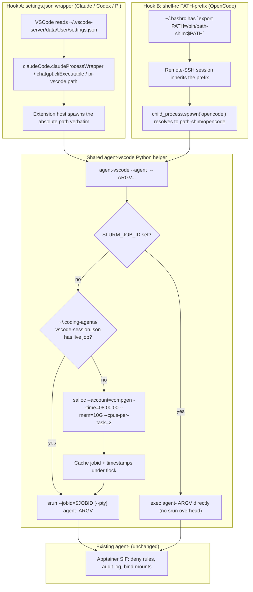

# VSCode Extension Wrapping for HPC Sandbox

## Overview

Make every coding-agent CLI invocation that originates from a VSCode (or Cursor) extension on the lab's HPC cluster route through the existing `agent-<n>` Apptainer wrapper, just as terminal-launched agents already do. Today the four extension panels (Claude Code, ChatGPT/Codex, OpenCode, Pi) spawn their CLIs directly on the login node — bypassing the SIF, the deny rules, the audit log, and SLURM accounting that the terminal flow has enforced since Sprint 1.

The plan implements the design captured in the [brainstorm](../brainstorms/2026-04-27-vscode-extension-wrapping-brainstorm.md): one shared Python helper (`agent-vscode`) handles SLURM session-allocation and `srun --jobid` dispatch; four thin per-extension stubs add agent-specific env passthrough; settings.json wrapper hooks (`claudeCode.claudeProcessWrapper`, `chatgpt.cliExecutable`, `pi-vscode.path`) catch Claude/Codex/Pi deterministically; OpenCode is caught via a `$PATH`-prefix shim added to the existing shell-rc injection. Doctor gains `--scan-cron`/`--scan-systemd` modes for the documented gaps.

Total scope: ~480 LOC of new code (Python + bash + tests), one new pyproject dependency (`json5`), README updates linking to the existing launch-flow reference. Sequenced as one foundation phase + four per-extension phases (Pi → Claude → Codex → OpenCode per [brainstorm decision 12](../brainstorms/2026-04-27-vscode-extension-wrapping-brainstorm.md)) + one polish phase. Total estimate: ~12–15 hours, sized for a single engineer over ~3 working days.

## Problem Statement

The diagnostic capture from 2026-04-27 (`vscode_extensions_diagnostic_20260427_084046.txt`) showed three of four extensions running unsandboxed on the cluster login node:

- `node /hpc/.../node_modules/.bin/opencode --port 21337` (OpenCode v2, no SIF)
- `/hpc/.../extensions/openai.chatgpt-26.422.30944-linux-x64/bin/linux-x86_64/codex app-server` (Codex bundled binary, no SIF)
- `/hpc/.../extensions/anthropic.claude-code-2.1.120-linux-x64/resources/native-binary/claude --output-format stream-json …` (Claude bundled binary, no SIF)

Pi failed to start (couldn't find binary on its search paths). All four would, in their current configurations, run agents with no audit log entries, no `~/.ssh`/`~/.aws`/`~/.codex/auth.json` deny enforcement, no SLURM accounting, and no `--no-mount home,tmp` filesystem isolation. The lab's "all coding agents go through the SIF" promise breaks the moment a user clicks "Send" in any sidebar.

The brainstorm round resolved the architectural question by pairing two interception hooks (settings.json wrapper for the three extensions that expose one; PATH-prefix shim for OpenCode) with auto-`srun` job allocation, so the existing `agent-<n>` wrapper's strict SLURM gating doesn't block VSCode users on the login node. Implementation now lives in this plan.

## Proposed Solution

Two interception hooks + one shared SLURM-session helper:



The shared `agent-vscode` Python helper centralises the SLURM logic so the four per-extension stubs are 3-line bash scripts. The existing terminal `agent-<n>` is untouched. Pre-existing `SLURM_JOB_ID` (e.g. user opened the integrated terminal inside `srun --pty bash`) is reused, adding zero overhead. Failure handling is bounded: one retry on the next spawn ≥ 30 s after a `salloc` failure; permanent refuse afterwards until Cursor restart, explicit `coding-agents vscode-reset`, or 4-hour age-out.

## Technical Approach

### Architecture

#### Component map

```mermaid
graph LR
    settings[settings.json<br/>~/.vscode-server/data/User/settings.json]
    shellrc[~/.bashrc<br/>shell-rc injection]
    pyfile["src/coding_agents/runtime/agent_vscode.py<br/>(new ~250 LOC; standalone)"]
    stubs["bin/agent-claude-vscode<br/>bin/agent-codex-vscode<br/>bin/agent-pi-vscode<br/>bin/agent-opencode-vscode<br/>(4 × 3-line bash)"]
    pathshim["bin/path-shim/opencode<br/>(symlink to agent-opencode-vscode)"]
    helper[install_dir/bin/agent-vscode<br/>copy of agent_vscode.py with shebang]
    cache["~/.coding-agents/<br/>vscode-session.json<br/>(jobid cache; flock-protected)"]
    wrapper[bin/agent-claude<br/>bin/agent-codex<br/>bin/agent-opencode<br/>bin/agent-pi<br/>(existing terminal wrappers)]
    policy["installer/policy_emit.py:<br/>_emit_managed_vscode_settings()<br/>(new ~80 LOC)"]
    merger["installer/jsonc_merge.py<br/>(new ~60 LOC)"]
    doctor["commands/doctor.py:<br/>--scan-cron / --scan-systemd<br/>(new ~80 LOC)"]
    cli["cli.py: vscode-reset subcommand<br/>(new ~20 LOC)"]
    install_executor[installer/executor.py:<br/>extends _emit_managed_policy +<br/>inject_shell_block]
    inject[utils.py: inject_shell_block<br/>extended for path-shim]

    install_executor --> policy
    install_executor --> stubs
    install_executor --> helper
    install_executor --> pathshim
    install_executor --> inject
    inject --> shellrc
    policy --> merger
    policy --> settings
    settings -.bound at install time.-> stubs
    shellrc -.PATH inherits.-> pathshim
    pathshim --> stubs
    stubs --> helper
    helper --> cache
    helper --> wrapper
    cli -.clears cache.-> cache
    doctor -.scans for bare names.-> shellrc
```

#### File-level changes

| File | Change | Approx LOC |
|---|---|---|
| `src/coding_agents/runtime/__init__.py` | new package marker | 0 |
| `src/coding_agents/runtime/agent_vscode.py` | new — shared SLURM/jobid/srun helper | 250 |
| `src/coding_agents/runtime/jsonc_merge.py` | new — JSONC-tolerant deep-merge with atomic write + .bak | 80 |
| `src/coding_agents/installer/policy_emit.py` | add `_emit_managed_vscode_settings(install_dir, target_settings_path=None)` + `_resolve_vscode_settings_path()` helpers | 100 |
| `src/coding_agents/installer/wrapper_vscode.py` | new — emits the 4 per-extension stubs + path-shim | 80 |
| `src/coding_agents/installer/executor.py` | call `_emit_managed_vscode_settings` and `_emit_vscode_wrappers` from `_emit_managed_policy` for `state.mode != "local"` | 25 |
| `src/coding_agents/utils.py` | extend `inject_shell_block` to prepend `<install_dir>/bin/path-shim` (separate marker block) | 30 |
| `src/coding_agents/commands/doctor.py` | add `--scan-cron` / `--scan-systemd` flags + scanners | 100 |
| `src/coding_agents/commands/vscode_reset.py` | new — clears jobid cache + sentinel | 30 |
| `src/coding_agents/cli.py` | register `vscode-reset` typer subcommand | 5 |
| `pyproject.toml` | add `json5>=0.9` to dependencies | 1 |
| `tests/test_agent_vscode.py` | new — exhaustive auto-srun semantics | 280 |
| `tests/test_jsonc_merge.py` | new — JSONC tolerance, atomic write, .bak | 80 |
| `tests/test_emit_managed_vscode_settings.py` | new — settings emission, idempotency, preservation | 90 |
| `tests/test_doctor_scans.py` | new — cron / systemd scanners | 50 |
| `tests/test_wrappers.py` | extend — agent-<n>-vscode stubs render correctly | 40 |
| `README.md` | document `vscode-reset`, scan flags, the integration | 30 |
| **Total new/changed** | | **~1270** (LOC inflated by tests; product code is ~450) |

The brainstorm's ~480 LOC estimate covers product code (~450 above); tests add ~540 on top, totalling ~990 actual LOC. Reasonable for a feature this size.

#### Key data structures

**Jobid cache file** at `${XDG_RUNTIME_DIR:-$HOME/.coding-agents}/vscode-session.json`:

```json
{
  "schema_version": 1,
  "job_id": 12345678,
  "allocated_at": "2026-04-27T08:14:32Z",
  "expires_at": "2026-04-27T16:14:32Z",
  "cursor_pid": 4146098,
  "cursor_session_id": "abc123",
  "last_failure_at": null,
  "failure_count": 0,
  "salloc_command": "salloc --account=compgen --time=08:00:00 --mem=10G --cpus-per-task=2 --no-shell --job-name=cod-ag-vscode-dstoker-4146098"
}
```

Flock'd via `fcntl.flock(fd, LOCK_EX)` for the entire read-modify-write cycle. Schema version stamped per Sprint 2 Task 2.7's general approach (forward compat for future fields).

**Per-agent env passthrough lists** in `agent_vscode.py`:

```python
ENV_PASSTHROUGH = {
    "claude": [
        "CLAUDE_CODE_SSE_PORT", "CLAUDE_CODE_ENTRYPOINT", "CLAUDECODE",
        "CLAUDE_AGENT_SDK_VERSION", "CLAUDE_CODE_ENABLE_SDK_FILE_CHECKPOINTING",
        "MCP_CONNECTION_NONBLOCKING", "ANTHROPIC_API_KEY",
        "ANTHROPIC_BASE_URL", "ANTHROPIC_CONFIG_DIR",
    ],
    "codex": [
        "CODEX_HOME", "CODEX_INTERNAL_ORIGINATOR_OVERRIDE",
        "RUST_LOG", "DEBUG", "OPENAI_API_KEY", "OPENAI_BASE_URL",
        "CODEX_API_KEY", "CODEX_CA_CERTIFICATE", "CODEX_SQLITE_HOME",
    ],
    "opencode": [
        "OPENCODE_CALLER", "_EXTENSION_OPENCODE_PORT", "OPENCODE_CONFIG",
        "OPENCODE_CONFIG_DIR", "OPENCODE_CONFIG_CONTENT", "OPENCODE_PERMISSION",
        "OPENCODE_DISABLE_PROJECT_CONFIG", "OPENCODE_MODELS_URL",
        "OPENCODE_DISABLE_LSP_DOWNLOAD", "OPENCODE_DB", "OPENCODE_TEST_HOME",
        "OPENCODE_AUTH_CONTENT", "ANTHROPIC_API_KEY", "OPENAI_API_KEY",
    ],
    "pi": [
        "PI_VSCODE_BRIDGE_URL", "PI_VSCODE_BRIDGE_TOKEN", "PI_VSCODE_TERMINAL_ID",
        "PI_PACKAGE_DIR", "PI_SMOL_MODEL", "PI_SLOW_MODEL", "PI_PLAN_MODEL",
        "ANTHROPIC_API_KEY", "OPENAI_API_KEY",
        "GOOGLE_CLOUD_PROJECT", "GOOGLE_CLOUD_API_KEY",
    ],
}
```

Each entry is forwarded as `APPTAINERENV_${VAR}` if set in the parent's env. The wrapper's existing `provider.env` allowlist regex (`^[A-Z][A-Z0-9_]{0,63}$`) governs runtime validation — these are pre-validated names so no extra check needed.

**Settings.json wrapper-key emission** (per [brainstorm decisions 1, 6, brief §3.2](../brainstorms/2026-04-27-vscode-extension-wrapping-brainstorm.md)):

```jsonc
{
  // Claude Code
  "claudeCode.claudeProcessWrapper": "<install_dir>/bin/agent-claude-vscode",
  "claudeCode.useTerminal": false,
  "claudeCode.disableLoginPrompt": true,
  "claudeCode.initialPermissionMode": "acceptEdits",
  "claudeCode.environmentVariables": [
    { "name": "CLAUDE_CODE_ENTRYPOINT", "value": "claude-vscode" }
  ],

  // OpenAI Codex / ChatGPT
  "chatgpt.cliExecutable": "<install_dir>/bin/agent-codex-vscode",
  "chatgpt.openOnStartup": false,

  // OpenCode (defence-in-depth: integrated terminal also gets the path-shim)
  "terminal.integrated.env.linux": {
    "PATH": "<install_dir>/bin/path-shim:${env:PATH}"
  },

  // Pi
  "pi-vscode.path": "<install_dir>/bin/agent-pi-vscode"
}
```

The `terminal.integrated.env.linux.PATH` setting is defence-in-depth — the shell-rc injection is the primary mechanism for OpenCode, but this also catches the integrated-terminal flow when the user invokes `opencode` directly.

### Implementation Phases

#### Phase 0: Foundation (~3.5 h)

The shared infrastructure all four per-extension phases depend on. Lands in one commit before any per-extension work.

**Tasks**
- [ ] Create `src/coding_agents/runtime/__init__.py` (empty marker).
- [ ] Write `src/coding_agents/runtime/agent_vscode.py` — the shared SLURM helper. Self-contained Python script (shebang `#!/usr/bin/env python3`); minimal imports (`json, os, sys, subprocess, fcntl, time, pathlib`); one `main()` entrypoint.
  - [ ] Argv: `agent-vscode --agent <pi|claude|codex|opencode> [-- agent_argv...]`.
  - [ ] Detect `SLURM_JOB_ID` in env → exec `<install_dir>/bin/agent-<n>` directly with stdio-passthrough.
  - [ ] Detect `CODING_AGENTS_NO_WRAP=1` → exec the npm-installed binary at `<install_dir>/node_modules/.bin/<n>` directly (no SIF). [decision 11]
  - [ ] Else: read jobid-cache file under `flock`. If valid + `squeue -j $JOBID -h` confirms alive, `srun --jobid=$JOBID [--pty if isatty(0)] agent-<n> argv`. Otherwise allocate via `salloc --no-shell ...` and cache the jobid.
    - **JOB_ID extraction (deepen-plan finding 2026-04-27)**: `salloc --no-shell` writes `salloc: Granted job allocation N` to **stderr** (not stdout) and exits without exporting `SLURM_JOB_ID` (since no shell is spawned). Capture via stderr-parse: `JOB_ID=$(salloc … 2>&1 >/dev/null | grep -oP '(?<=job allocation )\d+')` or the Python equivalent `subprocess.run(..., capture_output=True)` then regex over `result.stderr`.
  - [ ] On `salloc` failure: write `last_failure_at` + `failure_count` to cache; print structured error to stderr (so VSCode notification shows it); exit 13.
  - [ ] On retry path (cache has `failure_count == 1`, last_failure_at ≥ 30 s ago): one more salloc attempt; if it also fails, increment failure_count to 2 and refuse without retry. [decision 1]
  - [ ] On `failure_count >= 2`: refuse immediately with the persistent-failure error. Cleared by `coding-agents vscode-reset`, by Cursor restart (cursor_pid mismatch), or by 4-hour age-out from `last_failure_at`. [decision 1]
  - [ ] Per-agent env-passthrough using the `ENV_PASSTHROUGH` table; `os.environ['APPTAINERENV_X'] = os.environ.get('X', '')` for each X.
  - [ ] PTY detection: `os.isatty(0)` → `srun --pty`; else no `--pty` (preserves stream-JSON pipes for Claude/Codex/OpenCode v2 vs PTY for Pi via createTerminal).
- [ ] Write `src/coding_agents/runtime/jsonc_merge.py` — JSONC-tolerant deep-merge.
  - [ ] `deep_merge_jsonc_settings(target_path, new_keys, *, backup=True)`.
  - [ ] Read with `json5.loads(target_path.read_text())` if file exists.
  - [ ] Recursive deep-merge: nested dicts merge key-by-key; lists overwrite; scalars overwrite.
  - [ ] Write via `tempfile.NamedTemporaryFile(delete=False) + fsync + os.replace + dirfsync` (mirroring Sprint 1 Task 1.2 atomic-write pattern, see `utils.py::secure_write_text`).
  - [ ] If `backup=True` and the target exists, write `<path>.bak` before first replace.
- [ ] Add `json5>=0.9` to `pyproject.toml` dependencies.
- [ ] Write `tests/test_agent_vscode.py` covering:
  - [ ] `SLURM_JOB_ID` set → execve `agent-<n>` directly (mock execve; assert called with right argv + env).
  - [ ] `CODING_AGENTS_NO_WRAP=1` → execve npm bin; never reaches salloc path.
  - [ ] No cache file → salloc executed; cache written with the right shape; srun executed.
  - [ ] Valid cache, `squeue -j` confirms alive → no salloc; srun executed with cached jobid.
  - [ ] Cache exists but `squeue -j` returns empty → re-allocate.
  - [ ] First salloc failure → `failure_count=1`, `last_failure_at` set; exit 13; stderr message visible.
  - [ ] Cache shows `failure_count=1` + `last_failure_at` ≥ 30 s ago → retry once.
  - [ ] Cache shows `failure_count=2` → refuse without retry.
  - [ ] Cache shows `failure_count >= 1` + `last_failure_at` < 30 s ago → refuse without retry (rate-limit).
  - [ ] Cache age-out (`last_failure_at` > 4 h ago) → reset state; allow fresh salloc.
  - [ ] Cursor pid changed (cursor_pid in cache != current `os.getppid()`) → invalidate cache; fresh allocation.
  - [ ] Concurrent calls: two `agent-vscode` invocations within ms → `flock` serialises; one allocates, other reuses (capture via subprocess execution + sleep instrumentation).
  - [ ] `os.isatty(0)` true → srun called with `--pty`; false → without.
  - [ ] Per-agent `APPTAINERENV_*` env-passthrough — every var in `ENV_PASSTHROUGH[agent]` that is set in input env appears as `APPTAINERENV_<NAME>` in `srun` invocation env.
- [ ] Write `tests/test_jsonc_merge.py` covering:
  - [ ] Plain JSON input → merged JSON output.
  - [ ] Input with `// comments` and trailing commas → parses; output is comment-free JSON; data preserved.
  - [ ] Deep merge: existing `{"foo": {"a": 1}}` + new `{"foo": {"b": 2}}` → `{"foo": {"a": 1, "b": 2}}`.
  - [ ] List replacement: existing `{"x": [1,2]}` + new `{"x": [3]}` → `{"x": [3]}`.
  - [ ] Atomic write: monkeypatch `os.replace` to raise → original target unchanged, `.bak` exists, error propagated.
  - [ ] `.bak` only created when target exists (no `.bak` for first-emission).

**Success criteria**
- All Phase-0 tests pass (≥ 25 new tests).
- `agent_vscode.py` runs as `python3 agent_vscode.py --agent claude -- --version` without errors when invoked outside a SLURM context (mocked `subprocess.run` for salloc/srun).
- `pyproject.toml` parses; `pip install -e .` succeeds with the new `json5` dep.

**Estimated effort:** ~3.5 h.

---

#### Phase 1: Pi (~2 h)

Pi is the lowest-risk extension to wire (settings-only override, single key, smallest env list). Implements the smallest-blast-radius first per [brainstorm decision 12](../brainstorms/2026-04-27-vscode-extension-wrapping-brainstorm.md).

**Tasks**
- [ ] Create `src/coding_agents/installer/wrapper_vscode.py` with:
  - [ ] `EXTENSION_STUBS: dict[str, str]` — for each agent, the bash content of `agent-<n>-vscode`. Pi's stub:
    ```bash
    #!/usr/bin/env bash
    exec "$(dirname "$0")/agent-vscode" --agent pi -- "$@"
    ```
  - [ ] `emit_extension_stubs(install_dir)` — writes the four stubs (initially only `pi`; Phases 2/3/4 add the others) to `<install_dir>/bin/agent-<n>-vscode` with `0o755`.
  - [ ] `emit_agent_vscode_helper(install_dir)` — copies `runtime/agent_vscode.py` to `<install_dir>/bin/agent-vscode`, fixes shebang to point at the install's Python, sets executable bit.
- [ ] Add `_emit_managed_vscode_settings(install_dir, target_settings_path=None)` to `installer/policy_emit.py`. For Phase 1, it emits only the Pi key:
  ```python
  new_keys = {
      "pi-vscode.path": str(install_dir / "bin" / "agent-pi-vscode"),
  }
  ```
  Calls `runtime.jsonc_merge.deep_merge_jsonc_settings(target, new_keys)`.
- [ ] Add `_resolve_vscode_settings_path()` returning the first existing path in:
  1. Caller-provided `target_settings_path`.
  2. `${VSCODE_AGENT_FOLDER}/data/User/settings.json` if env var set + path exists.
  3. `~/.cursor-server/data/User/settings.json`.
  4. `~/.vscode-server/data/User/settings.json`.
  5. `~/.vscode-server-insiders/data/User/settings.json`.
  6. `~/.windsurf-server/data/User/settings.json`.
  7. `~/.vscodium-server/data/User/settings.json`.
  Returns `None` if no candidate exists; caller decides whether to skip emission or surface a warning. [decision 6]
- [ ] Wire `_emit_managed_vscode_settings` and `emit_extension_stubs` + `emit_agent_vscode_helper` into `executor.execute_install` between phase 8a (managed-policy) and phase 9 (shell-rc). HPC mode only (`state.mode != "local"`).
- [ ] Pi-specific: bind-mount `<vscode-server>/extensions/pi0.pi-vscode-*` read-only inside the SIF (the bundled pi-side extension lives there per brief §1.4). Add a per-agent `pre_apptainer_binds` list to `agent_vscode.py` that the helper merges into `APPTAINER_BIND` before `exec`'ing the wrapper.
- [ ] Tests:
  - [ ] `tests/test_emit_managed_vscode_settings.py::test_emits_pi_path` — fresh `settings.json`, post-emit contains `pi-vscode.path` pointing at `<install_dir>/bin/agent-pi-vscode`.
  - [ ] `test_preserves_existing_keys` — existing `{"editor.fontSize": 14}` survives the emit.
  - [ ] `test_idempotent` — two emits produce byte-identical output.
  - [ ] `test_jsonc_input_with_comments` — input with `// foo` comments + trailing commas parses; output is plain JSON; data preserved.
  - [ ] `test_atomic_failure_keeps_original` — monkeypatch `os.replace` to raise; original unchanged; `.bak` exists.
  - [ ] `test_resolve_path_chain` — VSCODE_AGENT_FOLDER set → that wins over standard prefixes.
  - [ ] `tests/test_wrappers.py::test_pi_vscode_stub_renders` — Phase-1 emit produces `agent-pi-vscode` with the right `exec ... --agent pi --` argv.
  - [ ] `test_agent_vscode_pi_pre_apptainer_bind` — Pi case adds the pi-vscode extension dir to `APPTAINER_BIND` ro.
- [ ] **Manual verification (operator runbook):** see Phase-1 entry in §"Manual verification per agent" below.

**Success criteria**
- `coding-agents install` in HPC mode emits `pi-vscode.path` into the user's settings.json, creates `agent-pi-vscode` and `agent-vscode` under `<install_dir>/bin/`, and Pi's sidebar in VSCode opens without the "couldn't find binary" error.
- Phase-1 manual smoke confirms `ps -ef | grep agent-pi` shows the wrapped process under SLURM.

**Estimated effort:** ~2 h (small surface area, mostly bench-testable; the manual smoke is the long pole).

---

#### Phase 2: Claude (~2.5 h)

Claude's settings hook is well-documented and the existing wrapper already handles `~/.claude/` bind-mount + credentials. Adds env passthrough complexity (largest list among the four).

**Tasks**
- [ ] Extend `EXTENSION_STUBS` with `claude` entry; `wrapper_vscode.emit_extension_stubs` now writes `agent-claude-vscode`.
- [ ] Extend `_emit_managed_vscode_settings` with the four Claude keys:
  ```python
  new_keys.update({
      "claudeCode.claudeProcessWrapper": str(install_dir / "bin" / "agent-claude-vscode"),
      "claudeCode.useTerminal": False,
      "claudeCode.disableLoginPrompt": True,
      "claudeCode.initialPermissionMode": "acceptEdits",
      "claudeCode.environmentVariables": [
          {"name": "CLAUDE_CODE_ENTRYPOINT", "value": "claude-vscode"}
      ],
  })
  ```
- [ ] Defensive fix: VSCode trusted-workspace bug `anthropic/claude-code#10217` deletes `claudeCode.environmentVariables` on activation. **Critical**: don't put load-bearing env in that key. Our `agent-claude-vscode` already sets the env via `ENV_PASSTHROUGH["claude"]` from `agent_vscode.py`. The settings.json `environmentVariables` is just a non-critical hint. [brief Part 5.5]
- [ ] Add Claude-specific binds to `agent_vscode.py` `pre_apptainer_binds`:
  - `~/.claude:~/.claude` writable (already in Sprint 1.5 wrapper)
  - `~/.claude.json:~/.claude.json` writable (separate file at $HOME root, not inside `.claude/`)
  - `~/.cache:~/.cache:ro` (bun cache, npm cache for MCP via npx)
  - `~/.bun:~/.bun:ro`, `~/.npm:~/.npm:ro` (if MCP servers use them)
  - `/etc/ssl/certs:/etc/ssl/certs:ro`, `/etc/pki:/etc/pki:ro` (TLS)
  - `/etc/resolv.conf:/etc/resolv.conf:ro`, `/etc/hosts:/etc/hosts:ro` (DNS)
  - `~/.gitconfig:~/.gitconfig:ro`
- [ ] Tests:
  - [ ] `test_emit_includes_claude_keys` — settings.json emit contains all five Claude keys.
  - [ ] `test_useTerminal_set_false` — emit sets `claudeCode.useTerminal: false` (defends against the wrapper-bypass-when-true gotcha; brief Part 5.5).
  - [ ] `test_claude_env_passthrough` — `CLAUDE_CODE_SSE_PORT=37386` in input env → `APPTAINERENV_CLAUDE_CODE_SSE_PORT=37386` in srun call.
  - [ ] `test_claude_pre_apptainer_binds` — agent_vscode for `claude` emits all eight binds in the right ro/rw shape.
- [ ] **Manual verification:** open Claude pane, send `summarise this file`, observe an entry in the audit log JSONL with `"agent":"claude"` + `"slurm_job_id":"<jobid>"` matching the cached session.

**Success criteria**
- Claude pane in VSCode launches via `agent-claude-vscode`; one `agent-vscode`-managed SLURM job is allocated; subsequent messages are routed via `srun --jobid` with no new salloc.
- The audit-log JSONL reflects every Claude invocation with the right argv + jobid.

**Estimated effort:** ~2.5 h.

---

#### Phase 3: Codex (~2.5 h)

Codex adds the env-list complexity + the SQLite/arg0-lockdir bind. The brainstorm-decided strategy is to use the SIF's pinned `@openai/codex` (not the extension's bundled binary) per [decision 5](../brainstorms/2026-04-27-vscode-extension-wrapping-brainstorm.md).

**Tasks**
- [ ] Extend `EXTENSION_STUBS` with `codex` entry.
- [ ] Extend `_emit_managed_vscode_settings`:
  ```python
  new_keys.update({
      "chatgpt.cliExecutable": str(install_dir / "bin" / "agent-codex-vscode"),
      "chatgpt.openOnStartup": False,
  })
  ```
- [ ] Codex-specific binds in `agent_vscode.py`:
  - `~/.codex:~/.codex` writable (auth.json, config.toml, logs_2.sqlite + WAL, tmp/arg0 lockdir, sessions, history) — already in Sprint 1.5 wrapper
  - `/tmp:/tmp` writable (codex spawns shells writing temp files; brief §1.2 sidecars)
  - `/dev/shm:/dev/shm` writable (SQLite WAL spillover on cluster filesystems)
  - `/etc/ssl/certs`, `/etc/pki`, `/etc/resolv.conf`, `/etc/hosts` — same as Claude
- [ ] Codex `app-server` PTY detection: codex uses `child_process.spawn` with `stdio: ['pipe', 'pipe', 'pipe']` per the brief — pipes, not PTY. So `os.isatty(0)` should return False; srun without `--pty`. Verify in test.
- [ ] Add a doctor health check for protocol-drift detection (per [decision 5](../brainstorms/2026-04-27-vscode-extension-wrapping-brainstorm.md)):
  - Read the bundled-binary version: `<vscode-server>/extensions/openai.chatgpt-*-linux-x64/bin/linux-x86_64/codex --version`
  - Read the SIF's pinned version: `apptainer exec <sif> codex --version`
  - If major.minor differ, warn: "Codex extension version <X> may not be compatible with SIF-pinned codex <Y>; if the chat panel shows 'unsupported app-server version', pin the extension to a known-compatible version (see Phase 4 OpenCode workflow — same `.vsix`-install + `extensions.autoUpdate: false` pattern works for the ChatGPT extension) or rebuild the SIF with a newer codex".
- [ ] Tests:
  - [ ] `test_emit_includes_codex_keys` — settings.json contains both Codex keys.
  - [ ] `test_codex_env_passthrough` — every var in `ENV_PASSTHROUGH["codex"]` is forwarded.
  - [ ] `test_codex_pre_apptainer_binds` — `/tmp` and `/dev/shm` bound writable.
  - [ ] `test_codex_pty_off` — `os.isatty(0) = False` → srun without --pty.
  - [ ] `test_doctor_codex_version_drift` — mocked extension version 26.422 vs SIF version 1.99 → warn fires; matching versions → no warn.
- [ ] **Manual verification:** open Codex sidebar, click "New thread", verify the JSON-RPC handshake completes (Output panel: "OpenAI ChatGPT" channel shows `initialize` → `initialized` → `thread/start`).

**Success criteria**
- Codex sidebar opens, "New thread" succeeds, follow-up messages route through the same SLURM job.
- `coding-agents doctor` shows green for Codex version compatibility.

**Estimated effort:** ~2.5 h.

---

#### Phase 4: OpenCode (~3 h)

The architectural outlier — no settings hook for either classic or v2; relies on the shell-rc PATH-prefix shim. Per [brainstorm decision 4](../brainstorms/2026-04-27-vscode-extension-wrapping-brainstorm.md).

**Version-pin context (deepen-plan 2026-04-27).** `sst-dev.opencode-v2` source has been removed from the public `sst/opencode` repo (issue #13501) and not restored. Current marketplace version: `0.1.1`. The published guidance for "freeze a specific extension version" is the global `extensions.autoUpdate: false` setting + manual `.vsix` install; there is no per-extension version-pin mechanism in VSCode as of late April 2026. Concrete user steps documented in Phase 5 README + a copy-pasteable runbook in `docs/vscode_integration.md`.

**Tasks**
- [ ] Extend `EXTENSION_STUBS` with `opencode`.
- [ ] Add `bin/path-shim/opencode` symlink to `<install_dir>/bin/agent-opencode-vscode` (created by `wrapper_vscode.emit_path_shim(install_dir)`). The path-shim dir contains only this one file.
- [ ] Extend `_emit_managed_vscode_settings` with the defence-in-depth setting:
  ```python
  new_keys.update({
      "terminal.integrated.env.linux": {
          "PATH": f"{install_dir}/bin/path-shim:${{env:PATH}}",
      },
  })
  ```
  This catches `opencode` typed in the integrated terminal even if the user disabled `.bashrc` sourcing.
- [ ] Extend `utils.inject_shell_block` to also prepend `<install_dir>/bin/path-shim` to `$PATH`. Use a separate marker block (`# >>> coding-agents-path-shim >>>` / `# <<< coding-agents-path-shim <<<`) so the existing `<install_dir>/bin` injection block stays untouched. Order matters: the path-shim block goes **after** any conda/uv/pyenv blocks the user may have, ensuring our prefix wins.
- [ ] OpenCode-specific binds in `agent_vscode.py`:
  - `~/.config/opencode:~/.config/opencode` writable
  - `~/.local/share/opencode:~/.local/share/opencode` writable
  - `~/.cache/opencode:~/.cache/opencode` writable
  - `~/.local/state/opencode:~/.local/state/opencode` writable
  - `~/.opencode:~/.opencode:ro` (legacy auth fallback per brief §1.3)
  - `/tmp:/tmp` writable
  - Standard SSL/DNS binds.
- [ ] Note: OpenCode uses HTTP IPC on a localhost port. With `--containall` (no netns), the host extension can reach `127.0.0.1:<port>` inside the SIF. Verified per [brainstorm "Why this approach"](../brainstorms/2026-04-27-vscode-extension-wrapping-brainstorm.md).
- [ ] Add a doctor health check: `which opencode` should resolve to `<install_dir>/bin/path-shim/opencode`. If it doesn't, warn ("path-shim not at front of PATH; OpenCode v2 will run unsandboxed").
- [ ] Tests:
  - [ ] `test_emit_includes_terminal_path` — settings.json contains `terminal.integrated.env.linux.PATH` with the prefix.
  - [ ] `test_path_shim_symlink_created` — installer creates the symlink at the right path with right target.
  - [ ] `test_inject_shell_block_path_shim_marker` — second injection block appears in `.bashrc` with its own markers.
  - [ ] `test_inject_shell_block_idempotent` — re-running install doesn't duplicate either block.
  - [ ] `test_remove_shell_block_strips_both` — `coding-agents uninstall` removes both blocks cleanly.
  - [ ] `test_doctor_path_shim_first` — mocked `which opencode` returns shim path → pass; returns npm path → warn.
- [ ] **Manual verification:** open OpenCode sidebar, send a message, run `ss -tlnp | grep <port>` from the host shell, confirm the listener is the SIF process. `which opencode` from a fresh shell should show the shim path.

**Success criteria**
- OpenCode v2 sidebar opens, sends a message, the responding HTTP server is the SIF-bound `opencode` (verified via netns + ps).
- `which opencode` in a fresh shell resolves to the path-shim.
- Existing `inject_shell_block` tests still pass; new path-shim block tests pass.

**Estimated effort:** ~3 h (path-shim + dual-marker shell-rc work is the most invasive piece).

---

#### Phase 5: Polish — vscode-reset, doctor scans, README, escape-hatch tests (~2 h)

Closes the documented gaps from [brainstorm decision 10](../brainstorms/2026-04-27-vscode-extension-wrapping-brainstorm.md) and ships the user-facing tooling.

**Tasks**
- [ ] Implement `coding-agents vscode-reset` — clears the jobid cache + sentinel.
  - [ ] New file `src/coding_agents/commands/vscode_reset.py` with `run_vscode_reset()`.
  - [ ] Reads `${XDG_RUNTIME_DIR:-$HOME/.coding-agents}/vscode-session.json`; if exists, calls `scancel $JOB_ID` (best-effort) and removes the cache file.
  - [ ] Idempotent: no-op if cache absent.
  - [ ] Wired into `cli.py` as a typer subcommand.
- [ ] Implement `coding-agents doctor --scan-cron`:
  - [ ] Run `crontab -l` (subprocess; non-fatal if no crontab).
  - [ ] Per line: regex-match against bare CLI names (`\b(claude|codex|opencode|pi)\b` not preceded by `/` and not part of a longer word).
  - [ ] Print warning per match with line number + recommended replacement (`<install_dir>/bin/agent-<n>` or `sbatch --wrap=...`).
- [ ] Implement `coding-agents doctor --scan-systemd`:
  - [ ] Run `systemctl --user list-unit-files --type=service --no-legend --plain` (subprocess).
  - [ ] For each unit, `systemctl --user cat <unit>` and grep `ExecStart=` for bare CLI names.
  - [ ] Same warning format.
- [ ] Add escape-hatch acknowledgement to doctor: surface `CODING_AGENTS_NO_WRAP=1` if set in env (informational, not warn).
- [ ] README updates:
  - [ ] Subcommands table: add `vscode-reset`, document `doctor --scan-cron` / `--scan-systemd`.
  - [ ] Step 3 (VSCode Extensions) in Installer Walkthrough: note that we now also emit wrapper settings into `~/.vscode-server/data/User/settings.json`.
  - [ ] Sandboxing reference: confirm the existing link to `possible_coding_agent_launch_flow_and_how_they_are_sandboxed_27_04_2026.md` is still accurate.
- [ ] Tests:
  - [ ] `tests/test_doctor_scans.py::test_scan_cron_warns_on_bare_name` — fake `crontab -l` output containing `0 9 * * * claude --check` → warning emitted with line number + recommendation.
  - [ ] `test_scan_cron_passes_on_absolute_path` — `0 9 * * * /hpc/.../coding_agents/bin/agent-claude --check` → no warning.
  - [ ] `test_scan_systemd_warns_on_bare_name` — analogous for systemd-user units.
  - [ ] `tests/test_vscode_reset.py::test_reset_removes_cache` — pre-create cache; run reset; cache gone.
  - [ ] `test_reset_calls_scancel` — mocked scancel called with the cached jobid.
  - [ ] `test_reset_noop_when_no_cache` — idempotent.
  - [ ] `test_doctor_no_wrap_acknowledgement` — `CODING_AGENTS_NO_WRAP=1` set → doctor surfaces it.
- [ ] **Manual verification:** install + activate all four extensions; run `coding-agents doctor` (full pass); add a test crontab with bare `claude --check`, run `doctor --scan-cron`, confirm warning.

**Success criteria**
- `coding-agents vscode-reset` clears state cleanly.
- Doctor scan modes detect 100% of test-case crontabs/units containing bare CLI names.
- README accurately documents the new subcommands.

**Estimated effort:** ~2 h.

---

### Phase summary

| Phase | Theme | Effort | Cumulative |
|---|---|---|---|
| 0 | Foundation (`agent-vscode` helper, JSONC merge, settings emit, tests) | ~3.5 h | 3.5 h |
| 1 | Pi (settings-only override; smallest surface) | ~2 h | 5.5 h |
| 2 | Claude (env list complexity; settings hook) | ~2.5 h | 8 h |
| 3 | Codex (SQLite/arg0 binds; protocol-drift doctor check) | ~2.5 h | 10.5 h |
| 4 | OpenCode (path-shim shell-rc work; defence-in-depth) | ~3 h | 13.5 h |
| 5 | Polish (vscode-reset, doctor scans, README) | ~2 h | 15.5 h |
| **Total** | | | **~15.5 h** |

A bit higher than the brainstorm's 10–15 h estimate; accounts for the doctor scan modes and the protocol-drift check, which weren't fully scoped at brainstorm time. Single-engineer over ~3 working days.

## Alternative Approaches Considered

These come from the brainstorm round and remain rejected. Carried forward for traceability:

1. **Refusing without `SLURM_JOB_ID` instead of auto-srun.** Rejected: would break GUI workflow (every sidebar click on login node fails). The auto-srun pattern is invisible to users for three of four extensions (latency hidden in extension auto-activation per [brainstorm "Why this approach"](../brainstorms/2026-04-27-vscode-extension-wrapping-brainstorm.md)).
2. **Always wrap, skip SLURM gate.** Rejected: loses SLURM accounting, defeats lab convention that compute work belongs in allocated jobs.
3. **Run unwrapped (host CLI direct).** Rejected: defeats the whole point of the work.
4. **Per-extension separate bash shims (the deep-research brief's default).** Rejected: 4× duplicate auto-srun logic, bigger audit surface, salloc bug fixed in 4 places. [brainstorm decision 2]
5. **Extending the existing terminal `agent-<n>` to handle both contexts.** Rejected: bigger blast radius; the well-tested terminal path now shares code with new VSCode path; one bug breaks both.
6. **Python typer subcommand `coding-agents vscode-spawn <agent>`.** Rejected: ~150 ms typer-app startup tax per spawn; the standalone Python script (~30–50 ms cold start) is fast enough.
7. **`code-wrapped` / `cursor-wrapped` IDE launcher (per brief).** Rejected: relies on user discipline to launch IDE through the launcher every time; double-clicking the app icon bypasses. The shell-rc injection works automatically for Remote-SSH'd workflows. [brainstorm decision 4]
8. **Bind-mounting the extension's bundled Codex binary into the SIF.** Rejected: brittle dependency on extension dir layout; library-deps risk. Use SIF's pinned codex; doctor warns on protocol drift. [brainstorm decision 5]
9. **Symlink-replacing the npm `node_modules/.bin/opencode` with our wrapper.** Rejected: `npm install` / `bun install` overwrites the symlink; auto-update wipes it. PATH-prefix is more robust. [brainstorm decision 4]
10. **A long-lived background daemon that pre-allocates SLURM jobs.** Rejected: orphan-cleanup complexity; the "auto-srun fires during extension auto-activation" pattern hides most of the latency without needing a daemon.
11. **Aggressive system-wide PATH injection (`/etc/profile.d`, system bash configs).** Rejected: bigger blast radius than the win; cron / systemd gap stays a documented case with absolute-path workaround. [brainstorm decision 10]

## System-Wide Impact

### Interaction graph

When a user clicks "Send" in the Claude sidebar (the canonical case), the chain reaction across processes and files:

1. **VSCode extension host** (`bootstrap-fork --type=extensionHost`) reads `~/.vscode-server/data/User/settings.json` (or whichever path `_resolve_vscode_settings_path` returned at install). Picks up `claudeCode.claudeProcessWrapper = <install_dir>/bin/agent-claude-vscode`.
2. **Extension host calls** `child_process.spawn(processWrapper, [<original argv>])`. The wrapper script (3-line bash stub) `exec`s `agent-vscode --agent claude -- <argv>`.
3. **`agent-vscode` (Python helper)** acquires `flock` on the cache file. Reads cache. Detects `cursor_pid` matches current `os.getppid()` (or its grandparent — extension host PID). If cache valid, skips salloc.
4. **`squeue -j $JOBID -h`** (subprocess) confirms the cached job is still alive. If not, deletes cache, re-allocates.
5. **`salloc --no-shell ...`** (subprocess; only on first invocation per Cursor session). Returns jobid; helper writes cache + releases flock.
6. **`srun --jobid=$JOBID [--pty] agent-claude <argv>`** (subprocess). srun enters the SLURM job context, propagates stdio through, then exec's our existing terminal wrapper.
7. **`agent-claude` (existing terminal wrapper)** sees `SLURM_JOB_ID` set (inherited from srun's env) → continues without auto-srun re-triggering. Validates `$PWD`, builds bind-mounts, builds `APPTAINERENV_*`, calls `apptainer exec`.
8. **Apptainer enters SIF**. Inside SIF: SSL certs, deny rules, audit-log JSONL hook, `/opt/agents/node_modules/.bin/claude` runs.
9. **`claude` (native binary inside SIF)** receives stdio piped from extension host (through srun, through apptainer). Initiates SSE session to `CLAUDE_CODE_SSE_PORT` (extension host listens on host loopback; SIF default netns sharing makes this reachable).
10. **User sees response** rendered in the Claude pane. Audit log entry persisted. SLURM accounting: `sacct -j $JOBID` shows usage attributed to `--account=compgen` with the correct user.

Two-level deep: `inject_shell_block`'s path-shim addition (Phase 4) → modifies `.bashrc` → next interactive shell sources it → that shell's `$PATH` includes `<install_dir>/bin/path-shim` → any process spawned by that shell (including subsequent VSCode `code` launches via Remote-SSH) inherits the prefix → OpenCode v2's `child_process.spawn("opencode")` resolves to the shim.

### Error & failure propagation

Errors flow upward through the layers:

- **`salloc` fails** (account out / partition full / connection error). `subprocess.CalledProcessError` caught in `agent_vscode.allocate_slurm_job()`. Writes `last_failure_at` + increments `failure_count` to the cache file. `print_to_stderr` with structured message: `agent-vscode: salloc failed (rc=N): <stderr>. Retry on next spawn or run 'coding-agents vscode-reset'.` Exits 13. The VSCode notification surfaces this stderr line as the user-visible error.
- **`srun --jobid` fails** (job died between `squeue` confirm and srun call — race). Same `CalledProcessError` path; the helper invalidates the cache and exits 14. Next spawn re-allocates fresh.
- **`apptainer exec` fails** (SIF unreadable, etc.). Existing wrapper's exit codes (5 = SIF unreadable, etc.) propagate up through `srun`'s exit code and through `agent-vscode`'s exec. The user sees the wrapper's existing error message via VSCode notification.
- **Settings.json corruption during merge** (other process writes mid-emit). `deep_merge_jsonc_settings` catches `json5.JSONDecodeError`; falls back to writing fresh content with `.bak` of the corrupt original. Logs at warn level.
- **Concurrent salloc attempts** (two spawns within ms — race). `flock` serialises; second waits for first to finish. If first allocates jobid, second reads the cache and uses it. No double-allocation.
- **Cron / systemd gap (no shell-rc PATH-prefix)**. Doctor `--scan-cron`/`--scan-systemd` flags warn; absolute-path workaround documented.

No silent failure swallowing — every error path either surfaces to stderr (visible in VSCode notification or terminal) or logs at warn level for `coding-agents doctor` to surface.

### State lifecycle risks

Each persistence step walked through for orphan / duplicate / stale-cache risks:

- **Jobid cache file** (`vscode-session.json`). Crash between `salloc` and cache write → orphan SLURM job (until 8-h timeout) + no cache record (next spawn re-allocates → second job alive). Mitigation: `flock` + atomic-write pattern (`tempfile + os.replace`); cursor_pid mismatch check invalidates stale cache from a crashed Cursor; `coding-agents vscode-reset` provides explicit cleanup; 8-h walltime caps the orphan exposure.
- **`.bak` file from JSONC merge**. If the merger crashes mid-write (after `.bak` is created but before `os.replace`), the user has a `.bak` and a target file in some state. The merger's error path always leaves the target intact (we only `os.replace` the temp at the very end); the `.bak` is the user's recovery copy.
- **Extension binary auto-update changes the path**. The VSCode extension dir name includes the version (`anthropic.claude-code-2.1.120-linux-x64`). Auto-update changes the version → new dir → old version dir disappears. Our settings.json key (`claudeCode.claudeProcessWrapper`) doesn't reference the extension dir; it points at our wrapper. Safe across auto-updates.
- **Settings.json clobbered by VSCode itself**. VSCode rewrites settings.json on certain UI actions. The `.bak` we write before each emit is a one-shot — a subsequent VSCode write would overwrite it. Mitigation: re-emit on `coding-agents sync` (existing command extends to also re-call `_emit_managed_vscode_settings`).
- **Cleanup on `coding-agents uninstall`**: `inject_shell_block`'s removal handles the path-shim block; the wrapper scripts and `agent-vscode` helper are under `<install_dir>/bin/` and removed by the existing rmtree. The settings.json wrapper keys are explicitly unset (new helper `_unset_managed_vscode_settings` writes `null` for our keys; VSCode treats `null` as "unset"). The jobid cache file is removed (with optional `scancel`).

### API surface parity

Five interfaces expose equivalent functionality:

- **`coding-agents install` (`mode != "local"`):** emits the wrap settings + creates `agent-<n>-vscode` stubs + `agent-vscode` helper + path-shim symlink + extends shell-rc.
- **`coding-agents sync`:** re-emits the wrap settings (idempotent). Useful when VSCode rewrites settings.json or when the extension version changes.
- **`coding-agents update`:** identical to sync for the wrap-settings emit; in addition, refreshes the `agent-vscode` helper if the package was upgraded.
- **`coding-agents uninstall`:** new `_unset_managed_vscode_settings` cleanly removes our keys; existing rmtree handles wrappers; extended `remove_shell_block` handles the path-shim block; jobid cache cleanup.
- **`coding-agents doctor`:** new `--scan-cron` / `--scan-systemd` flags; new check for path-shim being first in PATH; new check for Codex bundled-binary version drift.

All five surfaces share `_emit_managed_vscode_settings` (or its inverse). The `vscode-reset` subcommand is unique to the runtime side.

### Integration test scenarios

Five cross-layer scenarios that unit tests with mocks would never catch (added to `tests/integration/`):

1. **`test_full_claude_session_through_wrapper`**: mock SLURM via a fake `salloc`/`srun` that just runs the inner command; mock Apptainer with a fake `apptainer exec` that runs the binary directly. Run a full `agent-claude-vscode` invocation with `--print "test"` arg. Assert: jobid cache populated; `APPTAINERENV_CLAUDE_CODE_SSE_PORT` set in env; stdout from claude reaches the test harness; audit-log JSONL has an entry.
2. **`test_concurrent_spawns_share_one_job`**: spawn two `agent-vscode` invocations with 10 ms delay. Assert: exactly one `salloc` call (mocked), both spawns use the same jobid.
3. **`test_cursor_restart_invalidates_cache`**: spawn once with mocked PPID=1000; cache populated. Spawn again with mocked PPID=2000 (simulating Cursor restart). Assert: salloc called again; jobid in cache updates.
4. **`test_path_shim_via_bash`**: write a fake `.bashrc` with the injection, source it in a subshell, run `which opencode`. Assert: resolves to `<install_dir>/bin/path-shim/opencode`.
5. **`test_doctor_scan_cron_e2e`**: `crontab -l` returns `0 9 * * * claude --check`. Run `coding-agents doctor --scan-cron`. Assert: warning to stderr; non-zero exit.

These exercise the seam between the Python helper, the bash stubs, the shell-rc injection, and the existing wrapper — places where unit tests with mocks miss real interactions.

## Acceptance Criteria

### Functional Requirements

- [ ] `coding-agents install` (HPC mode) emits wrapper settings into the user's VSCode settings.json (resolved via the seven-step chain in [brainstorm decision 6](../brainstorms/2026-04-27-vscode-extension-wrapping-brainstorm.md)).
- [ ] All four `agent-<n>-vscode` stubs exist under `<install_dir>/bin/` post-install with `0o755`.
- [ ] `<install_dir>/bin/agent-vscode` (Python helper) exists and is executable.
- [ ] `<install_dir>/bin/path-shim/opencode` symlink exists and resolves to `agent-opencode-vscode`.
- [ ] `~/.bashrc` contains both the existing `<install_dir>/bin` injection block AND a new `<install_dir>/bin/path-shim` injection block, with appropriate markers.
- [ ] Clicking "Send" in any of the four extension panels (Claude / Codex / OpenCode v2 / Pi) launches the agent inside the SIF on a SLURM-allocated compute node.
- [ ] Pre-existing `SLURM_JOB_ID` is reused (no double-allocation when user runs `srun --pty` first then opens VSCode).
- [ ] `salloc` failure → clear error in VSCode notification + cache state for retry.
- [ ] One retry on next spawn ≥ 30 s after first salloc failure; permanent refuse afterwards (until `vscode-reset` / Cursor restart / 4-h age-out).
- [ ] `CODING_AGENTS_NO_WRAP=1` bypasses all wrapping in the helper.
- [ ] `coding-agents vscode-reset` clears the jobid cache + sentinel + best-effort `scancel`.
- [ ] `coding-agents doctor --scan-cron` warns on bare CLI names in user's crontab.
- [ ] `coding-agents doctor --scan-systemd` warns on bare CLI names in user's systemd-user units.
- [ ] `coding-agents doctor` warns when the path-shim isn't first in PATH (path-shim regression check).
- [ ] `coding-agents doctor` warns on Codex extension/SIF version drift.
- [ ] `coding-agents uninstall` cleanly removes wrapper settings, helper, stubs, path-shim, shell-rc injection, and the jobid cache.

### Non-Functional Requirements

- [ ] **Performance**: first-spawn latency ≤ 30 s wall-clock under normal SLURM conditions (5–15 s salloc + a few seconds of SIF entry); subsequent spawns ≤ 3 s. Mocked-subprocess unit tests run in < 1 s/test.
- [ ] **Atomicity**: settings.json merges are atomic; concurrent VSCode writes can't produce a half-emitted file. Verified by the atomic-write test using `os.replace` mock failure.
- [ ] **Concurrency safety**: two simultaneous `agent-vscode` invocations don't double-allocate. Verified by the flock test.
- [ ] **Test coverage**: every public function in `agent_vscode.py`, `jsonc_merge.py`, `wrapper_vscode.py`, `policy_emit._emit_managed_vscode_settings` covered by ≥ 1 unit test. `coverage report` shows ≥ 90% for these modules.
- [ ] **Idempotency**: `coding-agents install` run twice produces byte-identical `settings.json`, `<install_dir>/bin/`, and `~/.bashrc`.
- [ ] **Backward compat**: existing terminal `agent-<n>` flow unchanged; all 184 pre-existing tests pass.

### Quality Gates

- [ ] Full suite: 184 pre-existing + ≥ 50 new tests = ≥ 234 tests, 0 regressions.
- [ ] `ruff check src/coding_agents/runtime/ src/coding_agents/installer/wrapper_vscode.py src/coding_agents/commands/vscode_reset.py` clean.
- [ ] `mypy --strict src/coding_agents/runtime/ src/coding_agents/installer/wrapper_vscode.py` clean (the new modules are typed strictly; existing modules keep their current type strictness).
- [ ] Manual smoke (operator runbook below) passes for all four extensions on the lab HPC node before merging Phase 5.
- [ ] README updates merged with the rest of the work.

## Success Metrics

- **Sandbox coverage rate**: post-rollout, > 95% of agent invocations from VSCode panels appear in the audit log JSONL (sampled by `wc -l ~/agent-logs/<agent>-<date>.jsonl` against expected user activity). The 5% gap is the documented cron / systemd / hardcoded-path edge cases.
- **First-spawn latency p50**: ≤ 12 s (typical salloc time + SIF entry on the lab cluster).
- **Subsequent-spawn latency p50**: ≤ 1.5 s (`srun --jobid` overhead).
- **VSCode-launched audit-log entries** distinguishable from terminal-launched (the helper writes a `vscode_launched: true` field in the audit log JSONL; new field, opt-in via the helper).
- **Doctor scan signal**: 100% of test crontabs containing bare CLI names produce a warning. Lab admin can run `coding-agents doctor --scan-cron --scan-systemd` cluster-wide as a periodic check.
- **Operational health**: < 1 orphan SLURM job per user per week (an orphan = a `cod-ag-vscode-*` job alive after Cursor session has ended). Tracked via `sacct` aggregation.

## Dependencies & Prerequisites

- **External**:
  - Apptainer 1.4+ on every target node (Sprint 1.5 acceptance verifies this).
  - SLURM with the `--no-shell` salloc option (any modern SLURM; verified per [brainstorm "Why this approach"](../brainstorms/2026-04-27-vscode-extension-wrapping-brainstorm.md)).
  - `json5` Python package on PyPI (≥ 0.9; pure-Python; zero external deps).
  - `jq` on host PATH (already required by the existing wrapper post-Sprint 1).
- **Internal**:
  - Sprint 1 + Sprint 1.5 already merged on `main` — provides the `agent-<n>` terminal wrappers + bind-mount logic + audit log + deny rules. This plan layers on top.
  - `coding-agents install` shell-rc injection (`utils.inject_shell_block`) — extended in Phase 4.
  - `policy_emit._emit_managed_policy` — extended in Phase 1 to call the new `_emit_managed_vscode_settings`.
  - `tests/test_wrappers.py` patterns (existing) — extended.
- **Resource**:
  - SLURM allocation under `--account=compgen` or equivalent for manual smoke testing.
  - VSCode 1.104+ (Cursor compatible) running Remote-SSH to the lab cluster.
  - Each of the four extensions installed in the user's VSCode-server: Claude Code, ChatGPT/Codex, OpenCode v2, Pi.

## Risk Analysis & Mitigation

| Risk | Likelihood | Impact | Mitigation |
|---|---|---|---|
| `salloc --no-shell` semantics differ on this cluster's SLURM build (allocation doesn't persist after salloc exits) | Low (deepen-plan 2026-04-27 confirmed standard SLURM 22.x/23.x behaviour) | High (breaks the entire approach) | Verify in Phase 0 manual smoke. If broken on this cluster's build, fallback: `salloc` blocks; run it inside a detached subprocess and capture jobid from stderr's first line; helper exits, jobid persists with the salloc subprocess. More complex but works. |
| PAM/Prolog interaction with `--no-shell` skips session setup, then `srun --jobid` returns "Invalid job id" or the job vanishes from `squeue` immediately | Low (cluster-specific config) | Medium (auto-srun looks broken; hard to diagnose) | Helper detects this via `squeue -j` returning empty within seconds of allocation; logs a structured warning; falls back to per-spawn salloc (slower but correct). `coding-agents doctor` adds a one-shot test: allocate via `salloc --no-shell` + immediately `srun --jobid=$ID true` to surface the issue at install time. |
| VSCode extension auto-update changes settings keys (e.g., `claudeCode.claudeProcessWrapper` renamed) | Medium | Medium (breaks the wrap silently) | Doctor adds a check: parse settings.json post-install, verify our keys are still present and intact; warn on mismatch. CI integration test against the version pinned in this plan; bump pins explicitly when the matrix moves. |
| User's shell isn't bash (uses zsh/fish) | Medium | Medium (path-shim missing for OpenCode) | `inject_shell_block` already handles bash + zsh + fish per the existing implementation; verify path-shim block survives all three. Test on zsh in CI. |
| `~/.vscode-server/data/User/settings.json` doesn't exist at install time (user hasn't connected VSCode yet) | Medium | Low (settings emit silently skipped) | Doctor warns when settings emit was skipped. User runs `coding-agents sync` after first VSCode connection to fix. |
| OpenCode v2 spawns with a curated `env` that doesn't inherit $PATH | Low | Medium (path-shim ineffective) | The diagnostic capture confirms the env IS inherited from extension host. If a future extension version changes this, settings-side `terminal.integrated.env.linux.PATH` is the defence-in-depth fallback. |
| Concurrent VSCode windows allocate multiple SLURM jobs (one per Cursor PID) | High | Low (~10G × 2cpu × N windows; uses but doesn't overrun cluster) | Each window gets its own job (cursor_pid disambiguator). Document in README: "each Cursor window allocates a separate session job". Lab admin can configure user QOS to cap concurrent jobs if needed. |
| User leaves Cursor open over weekend; 8-h job times out mid-conversation | Medium | Low (next spawn auto-allocates fresh) | The helper detects `squeue -j` returning empty → re-allocates. User sees a 5–15 s pause once, then back to normal. Documented in README. |
| Codex protocol drift between auto-updated extension and SIF-pinned codex (per [decision 5](../brainstorms/2026-04-27-vscode-extension-wrapping-brainstorm.md)) | Medium (annual frequency) | Medium (Codex sidebar stops working) | Doctor health check + README guidance to freeze extension version OR rebuild SIF. Annual SIF rebuild already in operational rhythm. |
| `~/.coding-agents/vscode-session.json` permissions issue on shared HPC home | Low | Medium (cache writes fail) | Use `XDG_RUNTIME_DIR` if available (typically tmpfs, fully writable); fall back to `$HOME/.coding-agents/`. If the fallback also fails, helper degrades to no-cache mode (allocate per spawn — 5–15 s every time). Doctor warns. |

## Resource Requirements

- **People**: 1 engineer. Solo-friendly given the plan structure (one phase per sitting). Two engineers could parallelize Phases 2–4 but the foundation (Phase 0) is sequential.
- **Time**: ~15.5 h product time. Calendar-time depends on availability — 3 working days at 5 h/day, or one focused week at 3 h/day.
- **Infrastructure**:
  - Lab HPC compute allocation for manual smokes (`--account=compgen --time=04:00:00 --mem=10G --cpus-per-task=2`, ~4 invocations per phase × 5 phases = 20 manual smokes total).
  - Local dev machine with VSCode + Python 3.12 for unit-test cycles.
  - Cursor-compatible client for cross-IDE smoke (optional but recommended for one Phase 4 verification).

## Future Considerations

- **Pre-warm SLURM allocation at install time**: a `coding-agents vscode-warmup` command that allocates a session jobid before the user opens Cursor. Eliminates the 5–15 s first-message latency entirely. ~1 h to implement; deferred unless user feedback complains about the latency.
- **Background daemon for jobid management**: a long-lived Python process that holds the salloc and serves spawn requests via a Unix socket. Eliminates Python startup tax per spawn (~30 ms × N spawns) and centralises orphan cleanup. Heavier; deferred to v2.
- **Multi-window job sharing**: a flock'd jobid cache per `cursor_session_id` (read from VSCode's `code-server`) instead of per `cursor_pid` would let multiple Cursor windows for the same user share one SLURM job. Resource-friendlier; needs user-feedback signal first.
- **Telemetry / usage metering**: currently the audit-log JSONL is the only signal. A `coding-agents stats` command that aggregates `~/agent-logs/*.jsonl` into per-user / per-agent / per-day usage rollups for lab admin reporting. Out of scope here.
- **Extension-side plugin to set claudeCode.environmentVariables defensively**: addresses the `anthropic/claude-code#10217` deletion bug by hooking into VSCode's workspace-trust callback. ~3 h; deferred until the bug actually bites users.
- **VSCode-side "coding-agents" sidebar**: a dedicated TreeView showing current SLURM job, audit-log tail, doctor status. Could ship as a small `coding-agents-vscode` extension by us. Big surface; out of scope.

## Documentation Plan

- **README**:
  - New `vscode-reset` and `doctor --scan-cron`/`--scan-systemd` rows in the Subcommands table.
  - Step 3 (VSCode Extensions) note: post-install we emit wrap settings into VSCode settings.json.
  - Sandboxing reference link: confirm still accurate (already added by Sprint 1.5 follow-up).
- **`docs/possible_coding_agent_launch_flow_and_how_they_are_sandboxed_27_04_2026.md`**:
  - Already covers all 22 launch paths (the matrix and worked examples).
  - Update to reference this plan once landed (link at the bottom).
- **In-repo `docs/vscode_integration.md`** (per [brief Implementation Plan](../wrapping_vscode_extensions_deep_research_27_04_2026.md)):
  - New file: operator-facing how-to for the VSCode wrap. Quick start, troubleshooting, FAQ.
  - Sections: "What gets wrapped", "What's the latency", "How to bypass", "How to reset", "Cron/systemd workarounds".
  - **Extension-version-pin runbook** (deepen-plan 2026-04-27): no per-extension pin in VSCode; the global pattern is:
    ```bash
    # 1. Download the exact .vsix you want from the marketplace API
    curl -L -o /shared/path/opencode-v2-0.1.1.vsix \
      https://marketplace.visualstudio.com/_apis/public/gallery/publishers/sst-dev/vsextensions/opencode-v2/0.1.1/vspackage
    # 2. Install in VSCode
    code --install-extension /shared/path/opencode-v2-0.1.1.vsix
    # 3. Disable auto-update globally in <VSCODE_AGENT_FOLDER>/data/User/settings.json
    {"extensions.autoUpdate": false}
    ```
    Same pattern applies for pinning Claude Code, ChatGPT/Codex, and Pi extensions — useful when the SIF rebuild cycle hasn't caught up to a breaking extension update.
- **CHANGELOG entry**: feature line summarising the wrap; mention the four extension settings keys touched + the path-shim addition.

## Manual verification per agent (operator runbook)

After Phase N's commits land, before moving to Phase N+1:

1. **Phase 1 (Pi) smoke**:
   - `coding-agents install` (HPC mode, fresh).
   - Verify `<install_dir>/bin/agent-pi-vscode`, `<install_dir>/bin/agent-vscode`, and `pi-vscode.path` in settings.json.
   - Open VSCode; activate Pi sidebar.
   - Send `@pi help`. Confirm response renders.
   - `ps -ef | grep agent-pi` shows `agent-pi-vscode → agent-vscode → srun → agent-pi → apptainer exec → pi`.
   - `squeue -u $USER -n cod-ag-vscode-*` shows one allocated job.
   - `cat ~/.coding-agents/vscode-session.json` shows the cached jobid + correct `cursor_pid`.
   - `cat ~/agent-logs/pi-$(date -I).jsonl` shows the latest invocation.
2. **Phase 2 (Claude) smoke**:
   - Same install state (Pi already wrapped).
   - Open Claude pane, type "summarise this file" with a small file selected.
   - Confirm response renders (full Claude session works).
   - Audit log entry; SLURM job reused (no second salloc).
   - `~/.claude/file-history/` populated (bind-mount works).
3. **Phase 3 (Codex) smoke**:
   - Open Codex sidebar, click "New thread".
   - Output panel "OpenAI ChatGPT" channel: `initialize` → `initialized` → `thread/start` sequence visible.
   - `~/.codex/logs_2.sqlite` updated (bind-mount writable).
   - SLURM job reused.
4. **Phase 4 (OpenCode) smoke**:
   - Reload bash to pick up the new path-shim block.
   - `which opencode` resolves to `<install_dir>/bin/path-shim/opencode`.
   - Open OpenCode v2 sidebar, send a message.
   - Response renders. `ss -tlnp | grep <port-from-_EXTENSION_OPENCODE_PORT>` shows the SIF process listening.
5. **Phase 5 polish smoke**:
   - `coding-agents doctor` shows green for path-shim placement + Codex version compat.
   - `coding-agents doctor --scan-cron` on a crontab containing `0 9 * * * claude --check` warns with line number + recommended replacement.
   - `coding-agents vscode-reset` removes the cache; next spawn re-allocates.
   - `coding-agents uninstall` cleanly removes everything.

## Sources & References

### Origin

- **Brainstorm document:** [`docs/brainstorms/2026-04-27-vscode-extension-wrapping-brainstorm.md`](../brainstorms/2026-04-27-vscode-extension-wrapping-brainstorm.md). Key decisions carried forward: auto-srun primary with bounded retry (decision 1); shared `agent-vscode` Python helper + 4 stubs (decision 2); shell-rc PATH-prefix for OpenCode (decision 4); SIF-pinned codex with doctor drift detection (decision 5); Pi → Claude → Codex → OpenCode rollout (decision 12).

### Internal references

- Existing terminal wrapper: `bundled/templates/wrapper/agent.template.sh` — argv-transparent; reused unchanged.
- Existing `_emit_managed_policy`: `src/coding_agents/installer/policy_emit.py:184` — pattern to extend.
- Existing settings merger: `src/coding_agents/merge_settings.py:merge_json_section` — JSON-only sibling of the new JSONC merger.
- Atomic-write pattern: `src/coding_agents/utils.py:secure_write_text` — Sprint 1 Task 1.2; reused for jsonc_merge.
- Shell-rc injection: `src/coding_agents/utils.py:inject_shell_block` (lines 313–376) — extended in Phase 4 with a separate marker block.
- Per-agent registry: `src/coding_agents/agents.py` — informs `ENV_PASSTHROUGH` defaults and per-agent metadata.
- Doctor command: `src/coding_agents/commands/doctor.py` — extended with `--scan-cron` / `--scan-systemd` flags.

### External references

- Deep-research brief: [`docs/wrapping_vscode_extensions_deep_research_27_04_2026.md`](../wrapping_vscode_extensions_deep_research_27_04_2026.md) — per-extension launch mechanism, IPC protocols, env contracts, Apptainer cross-cutting confirmations.
- Launch-flow companion: [`docs/possible_coding_agent_launch_flow_and_how_they_are_sandboxed_27_04_2026.md`](../possible_coding_agent_launch_flow_and_how_they_are_sandboxed_27_04_2026.md) — 22-row coverage matrix.
- Apptainer 1.4 docs: stdio passthrough confirmation, default netns sharing — both cited in the brief Part 4.
- Anthropic Claude Code SDK: `pathToClaudeCodeExecutable` semantics (issue `anthropic/claude-code#10491`).
- ChatGPT extension settings: `developers.openai.com/codex/ide/settings` — `chatgpt.cliExecutable` documentation.
- Pi extension: `github.com/pithings/pi-vscode/src/terminal.ts` (createTerminal API), `src/pi.ts:ensurePiBinary()` (binary detection order).
- OpenCode v2: source removed from public repo (`sst/opencode#13501`); behaviour reverse-engineered from the bundled `dist/extension.js` + the diagnostic capture.

### Related work

- Sprint 1 — `docs/plans/2026-04-27-001-fix-mvp-review-remediation-and-v1-finalization-plan.md` — established the baseline `agent-<n>` wrapper, audit log, deny rules, and bind-mounts that this work extends.
- Diagnostic capture: `vscode_extensions_diagnostic_20260427_084046.txt` (in the user's `~/Downloads/`) — first concrete observation of the four extensions running unsandboxed; motivated this whole effort.
- README "Sandboxing reference" section — links the launch-flow doc; preserved as-is.
