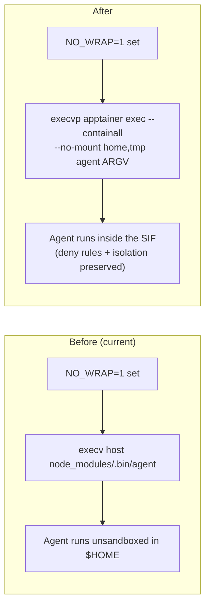

# Route CODING_AGENTS_NO_WRAP through SIF + drop host npm install entirely

## Overview

Today `CODING_AGENTS_NO_WRAP=1` exec's `<install_dir>/node_modules/.bin/<agent>` directly on the host — bypassing not just the wrapper logic but the SIF itself, the deny rules, the audit log, and Apptainer's `--containall` isolation. The env var was meant for wrapper-vs-agent triage; in practice it's a one-step back door out of every layer of sandboxing we've built.

This plan narrows the bypass to its intended scope. NO_WRAP=1 will continue to skip the wrapper template (cwd policy, audit-log JSONL emission, lab bind-mount construction, SLURM-session helper) but will run the agent **inside the SIF** via a direct `apptainer exec` — preserving the deny rules, the bind-mount discipline, and version pinning that the SIF carries.

With NO_WRAP no longer reaching the host npm-installed binary, the host `npm install` for **all three** npm-method agents (codex, opencode, pi) becomes dead weight: nothing in the codebase references their host binaries any more. The wrapper template routes through the SIF, which has all three agents baked in. We drop the host install entirely.

Pi's `post_install` step previously installed extensions (`pi-ask-user`, `pi-subagents`, `pi-web-access`, `pi-mcp-adapter`) on the host via `pi install npm:pi-foo`. Per a quick read of `pi-mono/packages/coding-agent/src/core/package-manager.ts:1841` and `settings-manager.ts:157`:

- `pi install npm:foo` does two things — a global `npm install -g foo` (writes to `npm root -g`, not `~/.pi/agent/`) AND a `addSourceToSettings("npm:foo")` write to `~/.pi/agent/settings.json`.
- Pi at runtime resolves `npm:foo` sources by looking them up in the active `npm root -g` (the SIF's), which is unaffected by the user's `~/.pi rw` bind.

So Pi extensions can be **baked into the SIF** at build time (lab admin runs `pi install npm:pi-ask-user` once inside the builder; packages land in the SIF's `npm root -g`). The settings file gets seeded into a SIF-side default at `/opt/pi-default-settings.json`, and a small first-run hook in the wrapper template copies it to `~/.pi/agent/settings.json` if missing. After that, runtime is identical to today's behaviour.

After this refactor: `coding-agents doctor` row 2 (Node.js) becomes a clean informational PASS — host node is genuinely never needed by any code path.

## Problem Statement / Motivation

Two real costs the current design carries:

1. **Sandboxing back door.** Anyone who sets `CODING_AGENTS_NO_WRAP=1` runs the agent unsandboxed in their home directory: no SIF, no deny rules, no audit log, no SLURM accounting. The `coding-agents doctor` warn row is a courtesy, not enforcement. Lab convention says "use it for triage only" but that's social, not technical.

2. **Host node requirement for no benefit.** `npm install --prefix <install_dir>` runs on the host, requires node ≥ 18 on `$PATH`, and writes hundreds of MB of `node_modules/` to per-user NFS. None of it gets used in the wrapped flow — the wrapper template does `apptainer exec <sif> codex ARGV` which uses the SIF's baked-in codex. The host install was ONLY there so NO_WRAP could exec the host binary, and so Pi's `post_install` could wire up extensions on the host. Both motivations evaporate once NO_WRAP routes through the SIF and Pi extensions move into the SIF build.

A user just hit the second problem: they ran `coding-agents install` once with a conda env that had node, then activated a different env, and now have a working install but `which node` fails. The doctor row WARNed correctly (post-recent fix) but the silent install dependency is fragile for new lab mates who don't happen to have a node env when they install.

The brainstorm decision (decision 11 in the VSCode-wrapping brainstorm) introduced NO_WRAP without nailing down whether it should bypass the SIF. This plan resolves that: it should not.

## Proposed Solution



`agent_vscode.exec_no_wrap` becomes a thin `apptainer exec` invocation. It preserves the SIF's deny rules and isolation guarantees, while still skipping every layer the lab maintainer might want to bypass for triage:

- The SLURM session helper (auto-srun + cache + flock + retry budget)
- The wrapper template's preconditions (cwd policy, $USER warning, audit log JSONL emission)
- The wrapper template's bind-mount construction (per-agent bind tables, pre-existing APPTAINER_BIND merge)

Per-agent minimal binds for NO_WRAP: `cwd:rw` plus the agent's config dir (e.g. `~/.codex`) so auth.json is reachable. No audit-log dir bind; that's the whole point of the bypass.

For the host install drop: in `executor._install_agent`, the `if method == "npm"` branch becomes per-agent gated. Codex and OpenCode skip the host npm install entirely; the wrapper installation later in phase 8 still creates `<install_dir>/bin/agent-<n>` which routes through the SIF. Pi keeps the host install path until a follow-up moves its `post_install` to the wrapped path.

## Technical Considerations

- **Apptainer-only-on-compute clusters**: NO_WRAP=1 on a login node will fail with `apptainer: command not found`. That's the correct failure mode — login nodes can't run any agent flow on this cluster anyway, the wrapper just normally hides that with auto-srun. Document loudly.
- **SIF path resolution**: `agent_vscode.exec_no_wrap` reads `$AGENT_SIF` (set by the shell-rc block) with a hard-coded fallback to `/hpc/compgen/users/shared/agent/current.sif` (matching `config.DEFAULT_SANDBOX_SIF_PATH`). If neither exists, fail with a clear message — same as the wrapper template's existing SIF-unreadable error.
- **Per-agent SIF binary names**: codex/opencode/pi/claude binaries are all on PATH inside the SIF (per the SIF build); no name-mapping needed. `apptainer exec <sif> codex` resolves correctly.
- **Stale `node_modules/` from previous installs**: harmless. Existing `<install_dir>/node_modules/.bin/codex` symlinks just stop being referenced. `coding-agents uninstall` already rmtree's the install dir.
- **`coding-agents update` for codex/opencode**: today calls per-agent `update_cmd`, which for npm agents shells out to npm. Once we drop the npm install, update for these two becomes a no-op — they update by rebuilding the SIF (lab admin task). Doctor's existing version-drift check (Phase 3 of the VSCode-wrapping plan) already covers this lifecycle.

## System-Wide Impact

### Interaction graph

`exec_no_wrap` callers:
1. **`agent_vscode.main()`** (one call site, line ~630) — when NO_WRAP=1 is set in the environment of a VSCode extension spawn.
2. **No other callers** — the function is local to `agent_vscode.py`.

`npm_install` callers in `executor.py`:
1. `_install_agent` for npm-method agents (line 284) — the call site we're modifying.
2. `_install_claude_statusbar` (line 361) — installs ccstatusline; **stays untouched** (separate concern, statusline lives outside the agent flow).
3. `_install_tools` (lines 437, 454) — installs biome, agent-browser; **stays untouched** (host tool, not an agent).

Callers of `<install_dir>/node_modules/.bin/<binary>`:
1. `agent_vscode.exec_no_wrap` — being rewritten.
2. `executor._install_agent` line 286 (post-install verification) — deleted alongside the npm-install drop.
3. `executor._install_agent` line 322 (Pi post_install argv rewrite) — deleted; the post_install loop itself is dropped, replaced by the wrapper-template first-run hook.

No other callers in src/, tests/, or docs/.

### Error & failure propagation

- `apptainer` not on PATH → `os.execvp` raises FileNotFoundError → caught in main(), exits 12 (EXIT_NO_AGENT) with a structured stderr message (`agent-vscode: NO_WRAP requires apptainer; run inside an srun --pty session`).
- SIF unreadable → `apptainer exec` exits non-zero → propagates through to the caller; user sees apptainer's own error message via the VSCode notification (same UX as a wrapper-side SIF failure).
- For codex/opencode skipped-npm install: no error path changes; `<install_dir>/bin/agent-codex` is still created in phase 8 via `_create_sandbox_wrappers`. The doctor agent-row check needs updating to look at the wrapper, not `node_modules/.bin`.

### State lifecycle risks

- **Old `<install_dir>/node_modules/@openai/codex/` from prior installs** — leaves orphaned files until uninstall. Acceptable; document in CHANGELOG.
- **Mid-refactor behaviour during update**: a user who has the old code and runs `coding-agents update` after pulling new code might end up with a half-updated state (new wrapper template + old npm-installed binary). Both wrapper template versions route through the SIF, so functionally equivalent — the orphaned host binary is harmless.

### API surface parity

- `coding-agents install` for codex/opencode/pi: faster (no npm install + no Pi post_install loop), no host node needed.
- `coding-agents install` for claude: unchanged (still curl method, still `~/.claude/bin/claude` symlink).
- `coding-agents update` for codex/opencode/pi: becomes no-op + log message ("agent runs from SIF; rebuild SIF to update — see lab admin").
- `coding-agents doctor`: row 2 (Node.js) further relaxed — note now drops the install-time qualifier for SIF-baked agents (only mentioned for `--local` mode, claude curl, and host tools). Agent-row check for codex/opencode/pi: switch from `node_modules/.bin/<bin>` existence to wrapper existence (`<install_dir>/bin/agent-<key>`) AND SIF readable.

### Integration test scenarios

These are the cross-layer cases worth pinning:

1. **`test_no_wrap_runs_apptainer_exec`** — set `CODING_AGENTS_NO_WRAP=1`; mock `os.execvp`; assert it's called with `apptainer` + `--containall` + the SIF path + the agent name + the forwarded argv.
2. **`test_no_wrap_minimal_binds`** — assert cwd is bound rw and the agent's config dir is bound rw, but the wrapper template's secrets/logs binds are NOT in the apptainer argv.
3. **`test_no_wrap_falls_back_to_default_sif_when_env_unset`** — `AGENT_SIF` unset → uses `DEFAULT_SANDBOX_SIF_PATH`.
4. **`test_install_skips_npm_for_sif_agents`** — install with state.agents = ["codex", "opencode", "pi"] → `npm_install` is never called for any of them; wrappers at `<install_dir>/bin/agent-{codex,opencode,pi}` ARE created.
5. **`test_install_keeps_npm_for_claude_and_host_tools`** — install with state.agents = ["claude"] + tools = ["linters"] → claude curl path runs, `npm_install` IS called for ccstatusline + biome (host tools, separate concern).
6. **`test_pi_first_run_hook_seeds_settings`** — pre-state: no `~/.pi/`. Mock `apptainer exec` to write a default settings file. Run wrapper template's first-run block. Assert `~/.pi/agent/settings.json` exists with the expected default content.

## Acceptance Criteria

### Functional Requirements

- [ ] `CODING_AGENTS_NO_WRAP=1` no longer references `<install_dir>/node_modules/.bin/<agent>`. The new code path uses `apptainer exec` against the SIF.
- [ ] On a node where `apptainer` is on PATH and the SIF is readable, NO_WRAP=1 + sending a sidebar message produces a working response (manual smoke).
- [ ] On a node where `apptainer` is missing (login node, lab cluster), NO_WRAP=1 fails immediately with a structured error pointing the user at `srun --pty bash`.
- [ ] `coding-agents install` for any subset of `{codex, opencode, pi}` runs to completion **without host node on PATH** and produces working `<install_dir>/bin/agent-<key>` wrappers.
- [ ] `coding-agents install` with claude selected still uses host curl (claude's existing path) — only npm-method agents are affected.
- [ ] `coding-agents doctor` agent-row check for any of codex/opencode/pi passes when the wrapper exists and the SIF is readable, regardless of whether `node_modules/.bin/<binary>` exists.
- [ ] `coding-agents doctor` row 2 (Node.js): when host node is missing AND the SIF is available → PASS-with-note saying "host node not required for any wrapped flow; only needed for `--local` mode + claude curl install + host tools (ccstatusline, biome)".
- [ ] First Pi sidebar message on a fresh user (no `~/.pi/`) populates `~/.pi/agent/settings.json` from the SIF default, then proceeds normally. Subsequent messages re-use the populated settings.

### Non-Functional Requirements

- [ ] **Backward compat**: 368 pre-existing tests still pass after refactor.
- [ ] **NO_WRAP message**: the stderr message printed when NO_WRAP fires lists exactly which protections it skips and which it preserves, so users don't think it's a full bypass.
- [ ] **Idempotency**: re-running `coding-agents install` against an existing install with stale `node_modules/` does not crash or produce noisy errors.

### Quality Gates

- [ ] All new + updated tests green.
- [ ] README + `docs/vscode_integration.md` updated — single source of truth for the NO_WRAP semantics; host node is no longer documented as a wrapped-flow prerequisite.
- [ ] CHANGELOG entry summarising the behaviour change.

## Open Questions

- **SIF builder recipe location.** This plan assumes the lab admin has a Singularity / Apptainer build recipe (`*.def` file) for the lab SIF, and that adding `pi install npm:pi-ask-user` lines is a one-edit change. The recipe likely lives outside this repo (lab admin's separate build infra). Phase 2b ships only the runtime/wrapper-template side; the SIF-side change is documented in `docs/vscode_integration.md` for the lab admin to act on. Confirm with operator before merging that the recipe-edit is feasible.
- **Pi auth.json placement.** Pi may also need a `~/.pi/agent/auth.json` (or similar) seeded for fresh users. The first-run hook copies `settings.json` only; if Pi requires more bootstrap state, the hook needs widening. Verify on the first manual smoke (a fresh user with empty `~/.pi/` whose first message succeeds end-to-end).
- **Existing-user migration.** Users who installed before this refactor have `<install_dir>/node_modules/` populated and `~/.pi/agent/settings.json` from the old `pi install` post_install. After this refactor, their state is identical to a fresh install's post-first-run state (settings.json populated). No migration needed for them. Confirm.

## File-Level Changes

| File | Change | Approx LOC |
|---|---|---|
| `src/coding_agents/runtime/agent_vscode.py` | rewrite `exec_no_wrap` to `apptainer exec` via SIF; add `_resolve_sif_path()` helper; update module docstring | +60 / -10 |
| `src/coding_agents/installer/executor.py` | drop `npm_install` call for npm-method agents (codex/opencode/pi); drop the post-install Pi-extension loop; tighten error messages | +5 / -25 |
| `src/coding_agents/commands/doctor.py` | switch agent-binary check to wrapper-existence + SIF-readable signals; update Node.js row note (no longer claims install-time need) | +20 / -10 |
| `src/coding_agents/bundled/templates/wrapper/agent.template.sh` | add first-run pi-defaults block (gated on AGENT_NAME=pi); ~10 lines | +15 |
| `tests/test_agent_vscode.py` | rewrite `test_main_no_wrap_execs_npm_bin` to assert apptainer exec; add 3 new NO_WRAP behaviour tests | +60 / -15 |
| `tests/test_no_wrap_via_sif.py` (new) | dedicated test file for the new NO_WRAP semantics + minimal binds + SIF fallback | +80 |
| `tests/test_install_skips_npm_for_sif_agents.py` (new) | pin codex/opencode/pi skip + claude/ccstatusline preserved | +60 |
| `tests/test_wrappers.py` | extend with `test_wrapper_template_pi_first_run_block` | +25 |
| `README.md` | rewrite "How to bypass" subsection; drop host-node prerequisite for SIF-baked agents | +15 / -10 |
| `docs/vscode_integration.md` | same prose + add "SIF-builder requirements" section listing the `pi install npm:pi-...` lines + the `/opt/pi-default-settings.json` dump | +25 / -8 |
| `CHANGELOG.md` (new entry or new file) | breaking-change entry for NO_WRAP semantics + host-node-no-longer-needed | +10 |
| **Total** | | **~360 LOC** |

## Implementation Phases

### Phase 1 — Narrow NO_WRAP through the SIF (~1 h)

- [ ] Rewrite `agent_vscode.exec_no_wrap` (call signature stays `(agent, agent_argv, install_dir)` for back-compat, but `install_dir` becomes optional / unused — document).
- [ ] Add `_resolve_sif_path()` helper that reads `AGENT_SIF` env var, falls back to `/hpc/compgen/users/shared/agent/current.sif` (matches `config.DEFAULT_SANDBOX_SIF_PATH`).
- [ ] Per-agent config dir map (claude→~/.claude, codex→~/.codex, opencode→~/.config/opencode, pi→~/.pi/agent), expanded then bound rw if extant.
- [ ] Stderr banner on NO_WRAP fire: explicit list of what's bypassed + preserved.
- [ ] Module docstring update.
- [ ] Tests: rewrite `test_main_no_wrap_execs_npm_bin` to assert `os.execvp("apptainer", ...)`; add `test_no_wrap_minimal_binds`, `test_no_wrap_falls_back_to_default_sif`, `test_no_wrap_apptainer_missing_clear_error`.

**Success criteria**: full suite green; manual smoke on the cluster (NO_WRAP=1 in an `srun --pty` shell + a small `agent-codex --version` invocation through it works).

### Phase 2 — Drop host npm install for codex + opencode + pi (~2 h)

- [ ] In `executor._install_agent`, drop the `if method == "npm"` npm_install call entirely for the three SIF-baked agents (codex, opencode, pi). The branch becomes a log line: "agent runs from the SIF — skipping host npm install". Claude (curl method) and the two non-agent npm tools (ccstatusline, biome, agent-browser) keep their npm installs unchanged.
- [ ] Drop `_install_agent`'s post-install loop (lines 318-326) — it only fires for npm-method agents and was solely for Pi's extension wiring. The new wrapper-template hook covers Pi.
- [ ] Update doctor's agent-row check (`commands/doctor.py:_gather_checks`): switch from `<install_dir>/node_modules/.bin/<binary>` existence to `<install_dir>/bin/agent-<key>` (wrapper) existence + SIF-readable. Same logic for all three agents.
- [ ] Update Node.js doctor row note: drop the "needed for install/update" caveat — it's now genuinely just for `coding-agents install` of host-side tools (ccstatusline, biome) and Claude's curl install. Document precisely.
- [ ] Tests: `test_install_skips_npm_for_sif_agents.py` covering codex/opencode/pi skip + claude unchanged + ccstatusline still emits.

**Success criteria**: `coding-agents install` for any subset of {codex, opencode, pi} runs end-to-end on a fresh shell **without host node on PATH**. The resulting `coding-agents doctor` is all PASS. `<install_dir>/node_modules/` exists only when claude or host tools are selected.

### Phase 2b — Wrapper-template first-run pi-defaults hook (~1 h)

- [ ] In `bundled/templates/wrapper/agent.template.sh`, add a small block (gated on `[ "$AGENT_NAME" = "pi" ]`) that runs *before* the `apptainer exec`:
  ```bash
  # First-run pi defaults: copy SIF-baked default settings if user has none yet.
  if [ ! -f "$HOME/.pi/agent/settings.json" ] && [ -r "$SIF_RESOLVED" ]; then
    mkdir -p "$HOME/.pi/agent"
    apptainer exec --containall --bind "$HOME/.pi/agent:$HOME/.pi/agent:rw" \
      "$SIF_RESOLVED" \
      sh -c 'cp /opt/pi-default-settings.json "$HOME/.pi/agent/settings.json"' \
      2>/dev/null || true
  fi
  ```
  Best-effort (`|| true`) — never blocks the actual agent invocation.
- [ ] Document the lab-admin SIF-builder requirement in `docs/vscode_integration.md`:
  - SIF build step adds `pi install npm:pi-ask-user` (etc.) inside the builder.
  - Build step writes `/opt/pi-default-settings.json` from the resulting `~/.pi/agent/settings.json` inside the builder.
  - One-line bash for the builder script — drop into the existing build recipe.
- [ ] Add doctor check `pi_default_settings_in_sif`: probe `apptainer exec <sif> test -r /opt/pi-default-settings.json` (cheap; no network). Warn if missing — the lab admin needs to update the SIF before the wrapper-template hook can succeed for new users.
- [ ] Tests:
  - `test_wrapper_template_pi_first_run_block` in `tests/test_wrappers.py` — assert the block renders for pi but not for the other agents.
  - `test_doctor_pi_defaults_in_sif` — mock the apptainer probe; assert PASS when label/file present, WARN when absent.
  - Manual smoke (operator, post-merge): on a fresh user with no `~/.pi/`, send a Pi sidebar message; afterwards `cat ~/.pi/agent/settings.json` shows the lab defaults.

**Success criteria**: a fresh user (no `~/.pi/` at all) gets a working Pi session on their first sidebar message, with all four lab defaults wired in.

### Phase 3 — Documentation + CHANGELOG (~30 min)

- [ ] README: "How to bypass" — explicit list of what NO_WRAP skips and keeps, with the apptainer-on-compute caveat.
- [ ] `docs/vscode_integration.md`: same prose; lift the "host node required" line out of the install prerequisites entirely for the wrapped flow; mention only `--local` + claude curl + host tools as remaining host-node consumers.
- [ ] CHANGELOG entry referencing this plan: NO_WRAP semantic change (breaking: now stays inside SIF) + host node requirement dropped for codex/opencode/pi.

**Success criteria**: docs grep clean — no remaining mentions of "NO_WRAP exec's host binary" or "node ≥18 required for install" with respect to the SIF-wrapped flow.

## Alternative Approaches Considered

1. **Kill NO_WRAP entirely.** Rejected: removes the wrapper-vs-agent triage path. Lab maintainer would have to reproduce wrapper bugs by hand-running `apptainer exec <sif> ...` every time.
2. **Keep the host npm install + drop NO_WRAP host path only.** Rejected: drops the back door but leaves the unnecessary host node dependency. Half a fix.
3. **Keep host npm install for Pi only, drop for codex/opencode.** Rejected after a quick read of `pi-mono`: Pi extensions go to the global npm root (not `~/.pi/agent/`), so they bake into the SIF cleanly. The settings file is the only per-user piece, and a 5-line wrapper-template hook handles it on first run. Half-measure unjustified once the path was clear.
4. **Run npm install through the SIF (`apptainer exec <sif> npm install --prefix <host>`).** Rejected: forces install to be on a compute node (since apptainer is compute-only on this cluster). Real regression for the install UX. Worth revisiting if the lab admin standardises install-via-srun.
5. **Bundle node into the install (uv venv with nodeenv, or pinned tarball at `/hpc/compgen/users/shared/agent/node/`).** Rejected: the cleaner alternative is to remove the host node need entirely (this plan), not paper over it.
6. **Pi env-var override for extension search path (option B from triage).** Rejected because the simpler path (a) Pi already supports global npm root discovery and (b) the settings file is only metadata — the wrapper-template hook is a smaller hammer than petitioning upstream for a new env var.

## Dependencies & Risks

| Risk | Likelihood | Impact | Mitigation |
|---|---|---|---|
| Existing user has set NO_WRAP=1 and depends on the old "skip the SIF entirely" semantic | Low (lab convention is triage-only) | Medium (their workflow breaks silently) | Phase 3 docs explicitly call out the semantic change; CHANGELOG entry; the new stderr banner makes the new semantics visible the first time the env var fires |
| Apptainer's argv on this cluster's version differs from the wrapper template's expected flags | Low (we already use the same flags in the wrapper template) | Medium | Mirror the wrapper template's `apptainer exec` argv exactly; only swap the bind-mount construction |
| SIF default path `/hpc/compgen/users/shared/agent/current.sif` not readable to a particular user | Low | Medium | Same failure mode as the wrapper template's existing SIF-unreadable error; reuses existing exit-code semantics |
| User runs `coding-agents update` after partial code update + has stale `node_modules/` for any of codex/opencode/pi | Medium | Low (orphan files only) | Document the stale-files outcome; `uninstall` rmtree's it cleanly |
| Pi's first-run defaults hook silently fails (e.g. `/opt/pi-default-settings.json` missing in SIF because the lab admin forgot the build step) | Medium (during rollout) | Medium (Pi sidebar comes up empty of lab defaults; agent still works, just no extensions) | The hook is best-effort (`|| true`); doctor adds a check ("Pi default settings reachable in SIF") that warns when `/opt/pi-default-settings.json` is missing inside the SIF; manual smoke covers the user-facing path |
| Lab admin forgets to update `/opt/pi-default-settings.json` after adding new extensions | Medium | Low (existing users keep old defaults; new users get whatever was current at SIF build) | Document in `docs/vscode_integration.md` SIF-builder section; `coding-agents pi-refresh-defaults` future command closes the loop |

## Future Considerations

- **`coding-agents update` for SIF-only agents.** Today it calls per-agent `update_cmd`; once codex/opencode/pi are SIF-baked, update for these means "rebuild the SIF". Worth consolidating into a single `coding-agents sif-info` / `coding-agents request-rebuild` command surface.
- **Drop Claude's host curl install too.** Same logic — Claude is in the SIF, the wrapper routes through the SIF, the host curl install only matters for `coding-agents update` (which calls `claude update`). Could add Claude's `~/.claude/bin/claude` to the same drop. Out of scope here — different install method, different test surface.
- **Pi default-settings refresh.** Today the wrapper-template hook only seeds `~/.pi/agent/settings.json` if missing. If the lab admin updates the SIF defaults, existing users keep their old settings. A `coding-agents pi-refresh-defaults` command (opt-in, merges new sources) would close that gap. ~15 LOC, deferred.
- **Drop `<install_dir>/node_modules/` from existing installs on update.** A `coding-agents update` that detects the directory and rmtree's it (after confirming) would clean up the migration artifact. Deferred — harmless if left alone.

## Documentation Plan

- README: VSCode integration section, "How to bypass" subsection, install prerequisites.
- `docs/vscode_integration.md`: the "How to bypass" how-to, the "Pinning extension versions" runbook (no change needed), the "Doctor checks" table (Node.js row note).
- `docs/possible_coding_agent_launch_flow_and_how_they_are_sandboxed_27_04_2026.md`: a one-line addition to the NO_WRAP row noting it now goes through the SIF.
- CHANGELOG: feature/breaking-change line.

## Sources & References

- VSCode wrapping plan (origin context): [`docs/plans/2026-04-27-002-feat-vscode-extension-wrapping-plan.md`](2026-04-27-002-feat-vscode-extension-wrapping-plan.md) — brainstorm decision 11 introduced NO_WRAP without nailing down the SIF-vs-host scope.
- Existing wrapper template: `src/coding_agents/bundled/templates/wrapper/agent.template.sh` — `apptainer exec` argv reference for the new NO_WRAP path.
- Existing `agent_vscode.exec_no_wrap`: `src/coding_agents/runtime/agent_vscode.py:392` — the function being rewritten.
- npm install call site: `src/coding_agents/installer/executor.py:283-288` — the gating point for Phase 2.
- Doctor agent-binary check: `src/coding_agents/commands/doctor.py:_gather_checks` (around line 92-112).
- Recent doctor Node.js fix: commit `9eea29b` (relaxed Node.js row to PASS-with-note when SIF has node).
- VSCode docs on Settings Sync + machine-scoped settings: cited in the prior turn that motivated the resolver fix in `7dc7109`.
